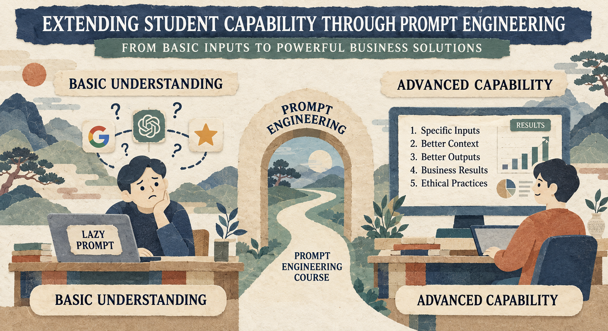

# Business AI Tools: Effective ChatGPT Communication

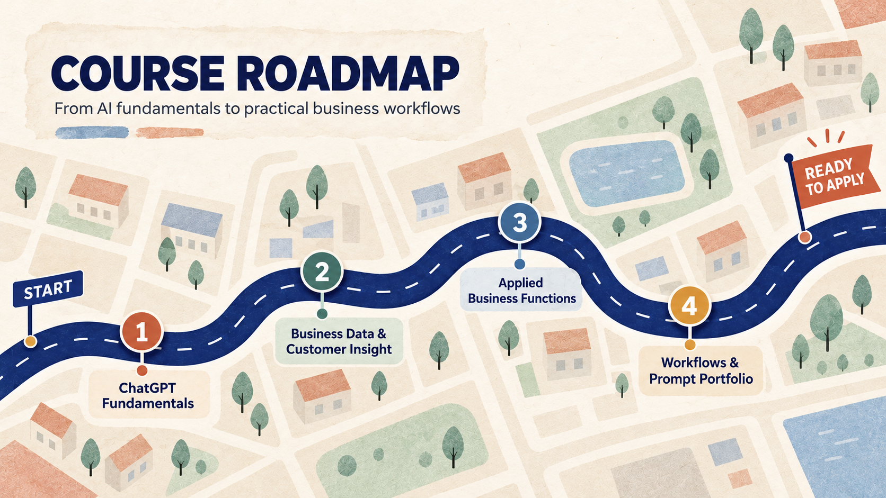

## Introduction to the Course in English
Prompt engineering is crafting precise, context-rich inputs to large language models such as OpenAI ChatGPT, Microsoft Copilot, and Google Gemini to generate useful, accurate, and relevant outputs. It is important because well-designed prompts unlock the full potential of AI, enabling businesses to automate analyses, drive insights, and enhance decision-making.

By the end of this course, students will be able to explain the fundamental principles and components of prompt engineering and how large language models interpret and generate responses. They will develop the skills to design clear, specific, and context-rich prompts tailored to key business-management scenarios such as marketing, finance, operations, and human resources. Through hands-on practice and iterative refinement, students will learn to evaluate the quality of AI outputs, identify biases or errors, and implement strategies for continuous prompt optimization. They will integrate prompt-driven workflows into real-world business processes, confidently automating routine analyses and report generation. Finally, students will demonstrate responsible and ethical use of AI by recognizing potential risks, ensuring data privacy, and establishing guardrails to mitigate bias in their applications.

---


#### Table of Contents (TOC)
- **[Module 1: Mastering ChatGPT Fundamentals](#module-1-mastering-chatgpt-fundamentals)**
  - [Session 1.1: Getting Started with ChatGPT in Business](#session-11-getting-started-with-chatgpt-in-business)
  - [Session 1.2: Structuring Your Prompts for Success](#session-12-structuring-your-prompts-for-success)
  - [Session 1.3: Writing Clear, Step-by-Step Instructions](#session-13-writing-clear-step-by-step-instructions)
  - [Session 1.4: Step-by-Step Problem Solving](#session-14-step-by-step-problem-solving)
- **[Module 2: Business Data, AI Quality, Projects & Customer Insight](#module-2-business-data-ai-quality-projects-customer-insight)**
  - [Session 2.1: Read Business Data Before Deciding](#session-21-making-sense-of-business-data)
  - [Session 2.2: Improve AI Results by Testing One Change](#session-22-quality-control--improving-ai-results)
  - [Session 2.3: Set a Manageable Project Scope](#session-23-scoping-projects--setting-goals)
  - [Session 2.4: Build Customer Profiles from Evidence](#session-24-market-strategy--customer-personas)
- **[Module 3: Hands-On Business Functions](#module-3-hands-on-business-functions)**
  - [Session 3.1: Financial Analysis & Executive Briefs](#session-31-financial-analysis--executive-briefs)
  - [Session 3.2: Operations & Process Improvement](#session-32-operations--process-improvement)
  - [Session 3.3: HR & Workplace Communication](#session-33-hr--workplace-communication)
  - [Session 3.4: Workplace AI Ethics, Privacy & Bias](#session-34-workplace-ai-ethics-privacy--bias)
- **[Module 4: Everyday Workflows & Your AI Portfolio](#module-4-everyday-workflows--your-ai-portfolio)**
  - [Session 4.1: Streamlining Recurring Workflows](#session-41-streamlining-recurring-workflows)
  - [Session 4.2: Troubleshooting & Polishing Prompts](#session-42-troubleshooting--polishing-prompts)
  - [Session 4.3: Reviewing & Selecting Your Best Prompts](#session-43-reviewing--selecting-your-best-prompts)
  - [Session 4.4: Building Your Professional Prompt Portfolio](#session-44-building-your-professional-prompt-portfolio)

---

### Course Structure & 3-Hour Session Blueprint
- **Total Course Length:** 4 Modules · 16 Sessions · **3 Hours per Session** (48 Total Contact Hours).
- **Standard 3-Hour (180-Minute) Class Schedule:**
  - **Hour 1 (50 min): Comprehensive Concept Lecture & Live Demonstration** - In-depth theory, business frameworks, common failure modes, instructor live demo, and class discussion.
  - *10-Minute Break*
  - **Hour 2 (50 min): Guided Hands-On Lab (Basic Exercise)** - Students follow guided steps to apply the session prompt architecture directly to the public business dataset.
  - *10-Minute Break*
  - **Hour 3 (50 min): Applied Business Challenge & Peer Debrief (Advanced Exercise)** - Students use the exact same dataset to solve an advanced business challenge (handling trade-offs, edge cases, executive pushback, or strategic synthesis).
- **Student Workbook & Lab Manual:** [Business_AI_Tools_Student_Worksheets.docx](Business_AI_Tools_Student_Worksheets.docx) - Complete 34-page companion workbook containing structured audit worksheets, step-by-step form completion guides, prompt scorecards, and executive challenge templates for all 16 sessions.

### Student Guide: Saving and Using Web Data (CSV & TSV Files)
Many sessions in this course utilize real public business data stored in CSV (Comma-Separated Values) or TSV (Tab-Separated Values) formats. These are lightweight, plain-text spreadsheet formats used throughout the business world. Follow this step-by-step guide to download and use these files easily:

1. **How to Download and Save from a Web URL:**
   - **Method A (Direct Link Download):** On the dataset link provided in the session, right-click the link and select **"Save link as..."** (Chrome/Edge) or **"Save target as..."**. Select a destination folder on your computer (e.g., `Documents/AI_Course/`), make sure the file name ends in `.csv` or `.tsv`, and click **Save**.
   - **Method B (When Browser Displays Raw Text):** If clicking a link opens a page displaying raw text with commas or tabs instead of downloading, press **Ctrl + S** (Windows) or **Cmd + S** (Mac). In the save dialog, change "Save as type" to **All Files (*.*)**, ensure the file extension is `.csv` or `.tsv` (do not let it save as `.txt` or `.html`), and click **Save**.
2. **How to Open and Inspect the Data:**
   - **Spreadsheet Software (Excel / Google Sheets):** Double-click the downloaded file to view it in Microsoft Excel, or open Google Sheets and go to `File > Import > Upload` to inspect the columns cleanly.
   - **Plain Text Editor (Notepad / TextEdit):** Right-click the file and select **Open with > Notepad** to view the raw data rows without automatic spreadsheet formatting.
3. **How to Ingest Sample Data into ChatGPT:**
   - Open your spreadsheet or text file.
   - **Always Include the Header Row:** Highlight the top header row containing the column names (e.g., `order_id`, `quantity`, `item_name`, `item_price`) plus the specific number of sample rows requested in the exercise (e.g., rows 1 to 20).
   - **Use Text Delimiters:** In ChatGPT, enclose the pasted rows inside clear symbols (such as `###` or `"""`) so the model understands where your instructions end and the raw data begins.

### Module 1: Mastering ChatGPT Fundamentals

<a id="session-11-getting-started-with-chatgpt-in-business"></a>
#### Session 1.1: Getting Started with ChatGPT in Business

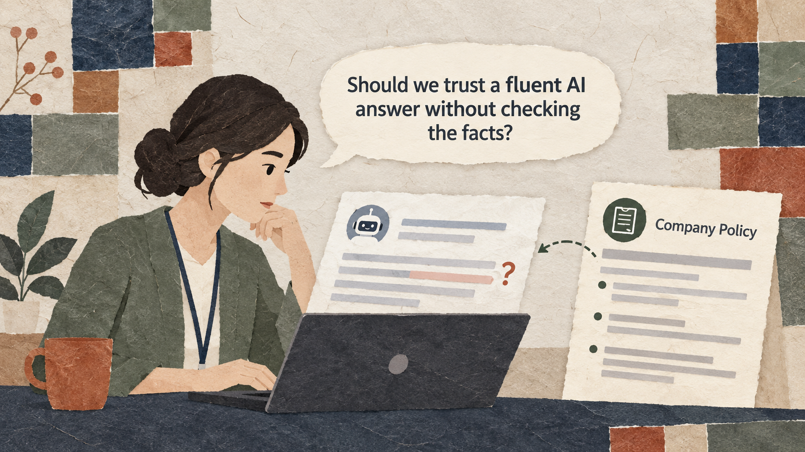

* **Lecture Presentation:** [Download Slides (PDF)](slides/session_1_1_lecture.pdf)

- **Duration:** 3 Hours (180 minutes)
  - *Hour 1 (50 min):* Comprehensive Concept Lecture & Live Demonstration
  - *Hour 2 (50 min):* Guided Hands-On Lab (Basic Exercise: Customer Review Comparison)
  - *Hour 3 (50 min):* Applied Business Challenge & Peer Debrief (Advanced Exercise: Multi-Issue Escalation)
- **Goal:** Learn what ChatGPT can and cannot do, understand how it generates text, and build safety habits for daily office tasks.
- **Lecture Content (Hour 1 - 50 Minutes):**
  - **Part 1: How LLMs Actually Work (15 min):**  
    *The Predictive Autocomplete Analogy:* Most business professionals mistakenly believe ChatGPT searches an encyclopedia database or "thinks" like a human. In reality, Large Language Models predict the next most likely word token based on statistical patterns learned from vast training datasets. When an LLM generates text, it calculates probability distributions across billions of parameters. Because it generates text probabilistically rather than retrieving hard records, it produces fluent language, but has no inherent sense of truth.
  - **Part 2: ChatGPT vs. Google Search - The Strategic Distinction (15 min):**  
    *Decision Framework:* Teach students when to search vs. when to prompt.
    - *Use Traditional Search (Google):* For verifiable historical facts, live stock quotes, statutory regulations, telephone numbers, and cited scientific research.
    - *Use Generative AI (ChatGPT):* For drafting executive correspondence, translating tone (e.g., technical jargon to layperson English), summarizing unformatted text, and brainstorming strategic angles.
    - *The Modern Business Hybrid Workflow:* (1) Gather verified facts from primary company sources -> (2) Feed those verified facts into ChatGPT to draft and format the communication.
    
    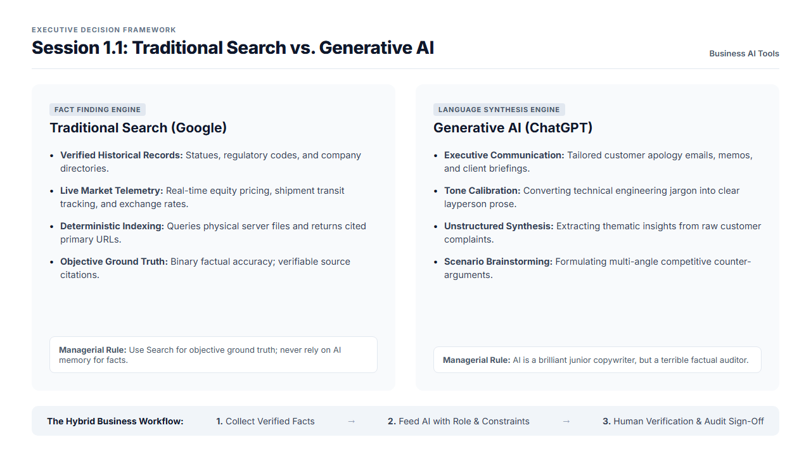
  - **Part 3: The Hallucination Problem & Enterprise Risk (10 min):**  
    *What is a Hallucination?* Plausibly sounding, highly confident statements generated by AI that are completely false.  
    *Case Study - Air Canada Lawsuit (2024):* An Air Canada customer service chatbot invented a non-existent bereavement refund policy. A customer relied on the chatbot's advice and sued when the refund was refused. The Canadian tribunal ruled Air Canada legally liable for its chatbot's hallucination.  
    *Managerial Golden Rule:* AI is a brilliant junior copywriter, but a terrible factual auditor. Never approve an AI-generated document without personally verifying dates, names, and calculations.
  - **Part 4: Instructor Live Demonstration Script & Discussion (10 min):**  
    *Step 1 (Naive Request):* Type `"Write an apology email to an angry customer whose delivery was late."` Note the empty platitudes (*"We value your business"*) and lack of actionable next steps.  
    *Step 2 (Engineered Prompt):* Type a structured prompt specifying Role (*"Customer Support Lead"*), Context (*"4-day courier delay on subscription coffee"*), Task (*"Draft 3-paragraph email"*), Constraints (*"Acknowledge delay in sentence 1; offer $10 credit code [COFFEE10]; explain backup carrier policy in 2 bullets; under 150 words"*).  
    *Discussion Question:* *"Why does setting a specific persona (like 'Senior Operations Lead') improve AI output quality?"* (Answer: It narrows the model's vocabulary and probability distribution toward professional domain terminology).
- **Public Data Source:** [PyCaret Open Amazon Customer Reviews Dataset (CSV)](https://raw.githubusercontent.com/pycaret/pycaret/master/datasets/amazon.csv) - Real open customer reviews and ratings.
- **Reference:** [Microsoft & LinkedIn: Work Trend Index Annual Report (2024)](https://www.microsoft.com/en-us/worklab/work-trend-index/ai-at-work-is-here-now-comes-the-hard-part) - Global enterprise study on AI workplace adoption, productivity metrics, and corporate risk.
- **Prompt Comparison:**
  - **Weak Prompt Example (Vague & Unstructured):**
    ```text
    Write an apology email to an angry customer whose delivery was late.
    ```
    *Why it fails:* Lacks role, operational context, order details, and constraints. ChatGPT defaults to hollow platitudes ("We value your business") with no actionable resolution.
  - **Strong Prompt Example (Structured & Constrained):**
    ```text
    You are the Customer Support Lead for an online artisanal coffee subscription brand.
    A long-time subscriber experienced a 4-day courier delay due to regional weather.

    Write a 3-paragraph apology email following these rules:
    1. Acknowledge and apologize for the shipping delay in the very first sentence.
    2. Offer a $10 store credit code [COFFEE10] toward their next monthly renewal.
    3. Explain our backup carrier routing policy in 2 concise bullet points.
    4. Maintain an empathetic, professional tone and keep the total length under 150 words.
    ```
    *Why it succeeds:* Establishes an authoritative persona, realistic business context, clear monetary resolution, and strict length/structure boundaries.
- **How to Practice:**
  1. **Step 1:** Open the public dataset link and copy 2 real customer reviews (one positive review and one complaint).
  2. **Step 2:** In ChatGPT, paste the reviews and enter a basic prompt: *"Write a customer service reply to these reviews."* Notice how generic the reply sounds.
  3. **Step 3:** In a new chat window, enter an engineered prompt: *"You are the Customer Support Lead for an online retail brand. Write a polite, empathetic, 3-paragraph reply apologizing for the issue, offering a replacement order, and explaining our quality check process. Tone: Warm and professional."*
  4. **Step 4:** Compare Output A and Output B side by side. Record your evaluation in the Prompt Specificity Scorecard.
- **What to Expect:** See how giving clear background information produces much more relevant, professional, and practical answers.
- **Exercise 1 (Basic - Customer Review Response Scorecard):**
  - Scenario: Using the PyCaret Amazon Customer Reviews dataset from this session, select one 5-star positive review and one 1-star negative complaint.
  - Task: Test a naive prompt versus the engineered Customer Support Lead prompt provided in the lesson.
  - Deliverable: Fill out a Prompt Comparison Scorecard evaluating both outputs across usefulness, accuracy, and executive tone (1-to-5 scale), accompanied by a 1-sentence diagnostic note.
- **Exercise 2 (Advanced - Multi-Issue Escalation & Internal Alert):**
  - Scenario: From the same Amazon Customer Reviews dataset, identify a complex negative review that cites multiple simultaneous operational failures (e.g., damaged product packaging, a delayed shipment, and an unresponsive delivery courier).
  - Task: Engineer an advanced prompt instructing ChatGPT to act as a Senior Customer Operations Lead. Apply strict negative constraints (no excuses, no blaming shipping couriers), propose a tiered resolution (immediate product replacement plus a promotional discount code), and generate a simultaneous 3-bullet internal operational alert for the warehouse fulfillment team.
  - Deliverable: A two-part deliverable: (1) A polished, empathetic customer reply under 150 words, and (2) A 3-bullet internal operational escalation note.

#### Session 1.2: Structuring Your Prompts for Success


* **Lecture Presentation:** [Download Slides (PDF)](slides/session_1_2_lecture.pdf)

- **Duration:** 3 Hours (180 minutes)
  - *Hour 1 (50 min):* Comprehensive Concept Lecture & Live Demonstration
  - *Hour 2 (50 min):* Guided Hands-On Lab (Basic Exercise: 4-Box Architecture Form)
  - *Hour 3 (50 min):* Applied Business Challenge & Peer Debrief (Advanced Exercise: Competitive Sales Battlecard)
- **Goal:** Master the 4-part prompt formula to consistently generate executive-ready business deliverables.
- **Lecture Content (Hour 1 - 50 Minutes):**
  - **Part 1: The Cost of Unstructured Prompts in Business (15 min):**  
    When employees give ambiguous prompts, ChatGPT generates an "average" response that requires multiple cycles of manual editing. Every cycle wastes valuable business hours. Prompt architecture provides the model with the exact structural boundaries it needs to produce workplace-ready output on the very first try.
  - **Part 2: The 4-Box Prompt Architecture Framework (15 min):**  
    Teach the 4 modular building blocks:
    1. **Role / Persona:** Establishes the authoritative viewpoint, tone, and professional vocabulary (e.g., *"Senior Product Marketing Director"*).
    2. **Business Context:** The operational backdrop, target customer, problem being solved, and market conditions.
    3. **Task Directive:** An unambiguous command verb stating the exact deliverable (e.g., *"Draft a launch announcement memo"*).
    4. **Output Format Template:** The exact schema, headings, bullet counts, and sections required.
  - **Part 3: Delimiters and Modular Prompt Design (10 min):**  
    Why delimiters matter: Using symbols like `###`, `---`, or `"""` clearly separates instructions from raw data. This prevents the model from confusing text to analyze with commands to execute, establishing clean prompt hygiene.

    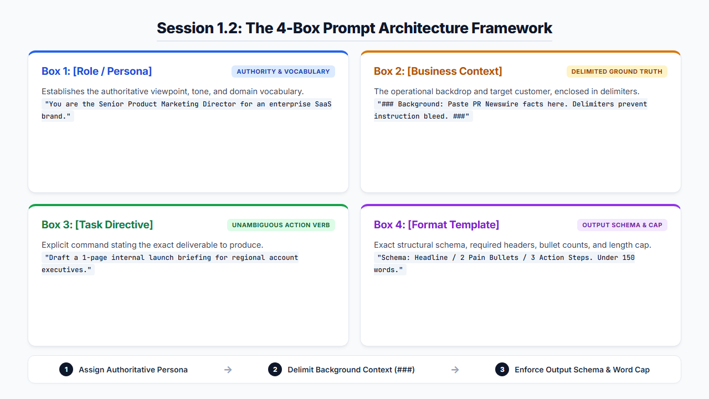

  - **Part 4: Instructor Live Demonstration Script & Discussion (10 min):**  
    *Live Demo:* Extract 4 facts from a corporate press release on PR Newswire. Type a 4-box modular prompt live on screen into ChatGPT to draft an internal company briefing. Show how defining the Output Format Template ensures the AI never outputs conversational pleasantries like *"Sure, here is your email!"*.  
    *Discussion Question:* *"If you omit the Output Format Template, what default formatting mistakes does ChatGPT typically make?"* (Answer: It produces rambling introductory paragraphs, inconsistent bullet points, and excessive sign-offs).
- **Public Data Source:** [PR Newswire Public Business Press Releases](https://www.prnewswire.com/news-releases/) - Free, real-world corporate product launch announcements and press releases.
- **Reference:** [OpenAI Official Prompt Engineering Guide](https://platform.openai.com/docs/guides/prompt-engineering) - Industry baseline standard for modular prompt architecture (delimiters, personas, context, and output schemas).
- **Prompt Comparison:**
  - **Weak Prompt Example (Vague & Unstructured):**
    ```text
    Summarize this corporate press release for our internal staff memo.
    ```
    *Why it fails:* ChatGPT will guess the audience, produce rambling paragraphs, include conversational filler ("Sure, here is your summary!"), and omit key business metrics.
  - **Strong Prompt Example (4-Box Architecture & Delimiters):**
    ```text
    Role: Senior Product Marketing Director.
    Business Context: We are preparing an internal product briefing for our regional sales reps regarding our competitor's new enterprise cloud software announcement.
    Task Directive: Extract key competitive facts from the press release delimited below and organize them into an executive briefing memo.

    Input Press Release:
    ###
    [Paste PR Newswire text here]
    ###

    Output Format Template:
    - Executive Headline: [1 sentence]
    - Core Customer Problem Solved: [2 bullets]
    - Target Market & Pricing: [1-2 bullets]
    - Threat Level & Sales Counter-Arguments: [3 numbered bullets]
    Constraint: Do NOT include conversational pleasantries or introductory greetings.
    ```
    *Why it succeeds:* Uses the 4-box architecture (Role, Context, Task, Format) with delimiters (###) to prevent instruction bleed and guarantee zero filler.
- **How to Practice:**
  1. **Step 1:** Open the PR Newswire page and click on any recent product launch announcement.
  2. **Step 2:** Read the article and extract 4 key facts: company name, product name, main customer problem solved, and target audience.
  3. **Step 3:** In your worksheet, build your prompt by explicitly filling in the 4 boxes: `[Role]`, `[Business Context]`, `[Task Directive]`, and `[Sample Output Template]`.
  4. **Step 4:** Copy your complete 4-part prompt into ChatGPT. Review the output to confirm whether it followed your exact output structure without extra conversational filler.
- **What to Expect:** Receive an answer that matches professional business formats without needing to rewrite it multiple times.
- **Exercise 1 (Basic - 4-Box Architecture Executive Memo):**
  - Scenario: Select one recent corporate product launch announcement from the PR Newswire public feed.
  - Task: Extract 4 core business facts (company name, product name, customer pain point, target market) and construct a prompt using the 4-Box framework (Role, Context, Task, Format) with delimiters to draft an internal company briefing.
  - Deliverable: Completed 4-Box Architecture Form and the formatted executive memo.
- **Exercise 2 (Advanced - Competitive Sales Battlecard & Objection Handler):**
  - Scenario: Using the exact same PR Newswire product announcement from Exercise 1, assume your company is the direct market competitor to the announcing firm.
  - Task: Write an advanced modular prompt instructing ChatGPT to act as a Director of Competitive Intelligence. Analyze the announcement to construct a 1-page "Sales Battlecard" for your sales reps containing: (1) Competitor Claim vs. Market Reality check, (2) Top 3 customer purchasing objections your reps will hear, and (3) 3 counter-arguments highlighting your product's competitive advantage.
  - Deliverable: A structured, schema-compliant Sales Battlecard ready to distribute to a sales team.

#### Session 1.3: Writing Clear, Step-by-Step Instructions


* **Lecture Presentation:** [Download Slides (PDF)](slides/session_1_3_lecture.pdf)

- **Duration:** 3 Hours (180 minutes)
  - *Hour 1 (50 min):* Comprehensive Concept Lecture & Live Demonstration
  - *Hour 2 (50 min):* Guided Hands-On Lab (Basic Exercise: 5-Constraint Summary Audit)
  - *Hour 3 (50 min):* Applied Business Challenge & Peer Debrief (Advanced Exercise: Bimodal Stakeholder Tone Calibration)
- **Goal:** Eliminate ambiguous phrasing and enforce strict negative and positive constraints on AI outputs.
- **Lecture Content (Hour 1 - 50 Minutes):**
  - **Part 1: The Power of Constraints in Executive Writing (15 min):**  
    Executives do not read long paragraphs. They scan for metrics, decisions, and deadlines. Generative AI naturally defaults to wordy, passive-voice prose. To make AI useful for leadership communication, managers must apply strict constraints that eliminate unnecessary words.
  - **Part 2: Positive vs. Negative Constraints (15 min):**  
    - *Positive Constraints (What to Include):* Format (e.g., *"Exactly 3 numbered bullet points"*), Length (e.g., *"Under 120 words"*), Target audience (e.g., *"Written for a first-time store manager"*), Required data (e.g., *"Must cite the $50 budget limit"*).
    - *Negative Constraints (What to Forbid):* Explicitly banning corporate fluff, clichés, and buzzwords (*"Do NOT use words like 'synergy', 'game-changer', 'delve', 'testament', or 'seamless'"*).
  - **Part 3: Calibrating Tone for Stakeholders (10 min):**  
    Demonstrate how tone constraints alter vocabulary:
    - *CFO Tone:* Quantitative, concise, risk-focused, zero adjectives.
    - *Frontline Employee Tone:* Empathetic, direct, step-by-step, actionable.

    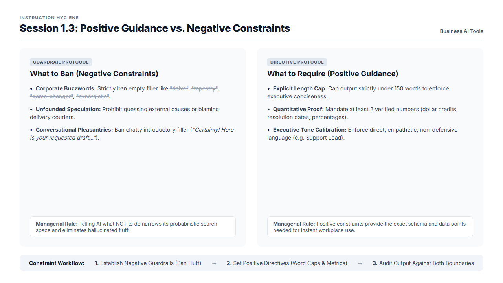

  - **Part 4: Instructor Live Demonstration Script & Discussion (10 min):**  
    *Live Demo:* Take a dense 400-word business operations policy from the SBA guide. Prompt ChatGPT without rules (producing 300 words of generic prose). Then prompt with 5 strict constraints. Count the words live on screen and show how negative constraints force crisp, high-density business communication.  
    *Discussion Question:* *"Why is it harder for AI to write under 100 words than over 500 words?"* (Answer: Compressing ideas requires prioritization and omission, whereas expanding text aligns with the model's natural statistical verbosity).
- **Public Data Source:** [US Small Business Administration (SBA) Business Guide](https://www.sba.gov/business-guide/manage-your-business) - Free public business operating guides and management guidelines.
- **Reference:** [HBS Working Paper 24-013 / BCG Study: Navigating the Jagged Technological Frontier](https://papers.ssrn.com/sol3/papers.cfm?abstract_id=4573321) - Field experiment on 758 BCG consultants showing why negative constraints and rules prevent superficial corporate AI fluff.
- **Prompt Comparison:**
  - **Weak Prompt Example (Vague & Unstructured):**
    ```text
    Give me some tips on how to manage retail store employees effectively.
    ```
    *Why it fails:* Produces a 500-word generic textbook essay filled with clichés ("foster communication", "lead by example") that no busy store manager has time to read.
  - **Strong Prompt Example (Positive & Negative Constraints):**
    ```text
    You are a Retail Operations Consultant. Summarize the employee management guidelines below for a first-time store manager.

    Follow these 5 strict constraints:
    1. Maximum length: Exactly under 120 words total.
    2. Format: Exactly 3 numbered bullet points, followed by one single "Action for Today".
    3. Tone: Direct, operational, and practical (no academic jargon).
    4. Negative Constraint: Do NOT use corporate buzzwords such as "synergy", "paradigm shift", "game-changer", "delve", or "testament".
    5. Required Content: Every bullet must include a specific operational behavior (e.g., morning shift huddles, checklist sign-offs).

    Source Guidelines:
    """
    [Paste SBA guide excerpt here]
    """
    ```
    *Why it succeeds:* Applies strict negative constraints to ban corporate fluff and enforces a tight word count and format, delivering high-density executive prose.
- **How to Practice:**
  1. **Step 1:** Open the SBA guide link and copy 2 paragraphs on managing business operations or staff.
  2. **Step 2:** In ChatGPT, test an unconstrained prompt: *"Summarize this text for my store."* Observe that the summary is too long and unstructured.
  3. **Step 3:** Write a constrained prompt: *"Summarize the text above under these 5 strict rules: (1) Maximum 120 words total, (2) Exactly 3 numbered bullet points, (3) Written for a first-time store manager, (4) Do NOT use words like 'synergy' or 'game-changer', and (5) Include one clear action step to take today."*
  4. **Step 4:** Run the constrained prompt. Audit the output line by line and mark Pass or Fail for each rule in your Rule Checklist Matrix.
- **What to Expect:** ChatGPT will follow your rules closely, giving a concise answer without unnecessary extra text.
- **Exercise 1 (Basic - 5-Constraint Summary Audit):**
  - Scenario: Copy two paragraphs on employee management from the US Small Business Administration (SBA) guide.
  - Task: Formulate and run a constrained prompt enforcing 5 strict rules: (1) Maximum 120 words, (2) Exactly 3 numbered bullets, (3) First-time manager tone, (4) Negative constraint banning buzzwords ("synergy", "game-changer"), and (5) One concrete action step.
  - Deliverable: Completed Rule Checklist Matrix marking Pass or Fail for each rule against the AI output.
- **Exercise 2 (Advanced - Bimodal Stakeholder Tone Calibration):**
  - Scenario: Using the exact same SBA employee management text from Exercise 1, your company must communicate this policy change to two contrasting stakeholder groups: the Chief Financial Officer and frontline hourly staff.
  - Task: Engineer a single master prompt that ingests the SBA text and produces two distinct, tone-calibrated deliverables:
    - Deliverable A (CFO Executive Brief): Strict 80-word ceiling, zero adjectives, quantitative, focused entirely on compliance cost and liability reduction.
    - Deliverable B (Frontline Employee Guide): Step-by-step operational checklist written at an 8th-grade reading level, encouraging, clear, and focused on daily shift routines.
  - Deliverable: Side-by-side comparison table showing both outputs and an analysis of how positive and negative constraints altered vocabulary choices.

#### Session 1.4: Step-by-Step Problem Solving


* **Lecture Presentation:** [Download Slides (PDF)](slides/session_1_4_lecture.pdf)

- **Duration:** 3 Hours (180 minutes)
  - *Hour 1 (50 min):* CoT concept lesson, prompt comparison, and live demonstration
  - *Hour 2 (50 min):* Guided assumption audit using a self-checkout case dataset
  - *Hour 3 (50 min):* Simple pilot review and improvement plan

- **Problem this session solves:** How can the supermarket reduce its peak-hour queue time while preserving accessible customer service and controlling cost and risk? The store already has two self-checkout kiosks and staffed lanes. The current decision is whether to add two more kiosks for a 90-day pilot while keeping the staffed lanes open. The current average queue is 7.5 minutes during the busiest period. A one-line AI question can produce a confident recommendation without enough evidence about queue time, cost, shrinkage, or customer access.
- **Goal:** Use Chain-of-Thought (CoT) prompting as the solution method: define the problem, separate evidence from assumptions, compare alternatives, and test the most promising option before scaling it.
- **Practice dataset:** [Self-checkout pilot dataset (CSV)](data/session_1_4_self_checkout_pilot.csv). This is fictional instructional data created for this exercise. It is not a forecast or a real company record.

- **Lecture Content (Hour 1 - 50 Minutes):**
  - **Part 1: What CoT is and why it is useful (15 min):**

    CoT is a request for a structured decision rationale, not a request to reveal private model reasoning. In this course, students use it to make the business analysis inspectable.

    - **Define the decision:** State the owner, deadline, alternatives, and success metric.

    - **Diagnose the evidence:** Separate facts supplied in the case from assumptions and missing information.

    - **Compare alternatives:** Assess each option using the same criteria, such as queue time, total operating cost, shrinkage risk, staff workload, and service access.

    - **Test before scaling:** Give a conditional recommendation with a pilot target and a stop rule.

    CoT is useful because a business recommendation is only credible when a student can explain what evidence supports it and what new evidence would change it.

  - **Part 2: What happens without a structured rationale (10 min):**

    A one-line question often forces the model to fill gaps with plausible but unverified details.

    - **False certainty:** The response may give an exact profit forecast even though no traffic, cost, or loss data were supplied.

    - **Hidden assumptions:** The response may assume customer acceptance, reliable technology, or adequate staff training without naming those assumptions.

    - **Unequal comparison:** One option may receive detailed benefits while another option receives only a vague description.

    - **No operating plan:** A recommendation may say "implement" without defining a pilot period, owner, target, or stop rule.

  - **Part 3: The four-stage CoT decision frame (15 min):**

    1. **Define:** What decision is being made? Who owns it? What outcome counts as success?

    2. **Diagnose:** Which facts are verified? Which assumptions must be tested? What information is missing?

    3. **Compare:** What are the realistic options? What are the benefits, trade-offs, and risks under the same criteria?

    4. **Test:** What 90-day pilot will provide evidence? What target means continue? What stop rule means pause or redesign?

    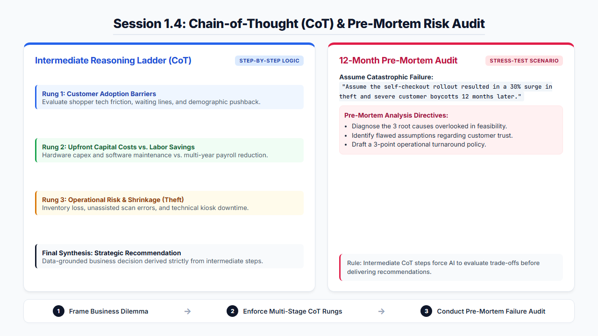

  - **Part 4: Instructor live demonstration (10 min):**

    Show the class the fictional self-checkout dataset. Ask students to predict which fields matter before they run a prompt.

    - **Known facts:** 84 peak-hour transactions per hour, 7.5-minute average queue time, two proposed kiosks, $1,150 monthly lease per kiosk, $250 monthly support cost, 1.2% baseline shrinkage, and 20% of peak shoppers aged 65 or older.

    - **Pilot thresholds:** Average queue time at or below five minutes, kiosk uptime at or above 98%, and shrinkage at or below 1.4% of sales.

    - **Discussion question:** Which of these values is a fact, which is a target, and which value would you still need before approving a full rollout?

- **Prompt comparison: two poor uses of CoT**

  - **Poor example 1: No decision frame**

    ```text
    Should our grocery store add two more self-checkout kiosks while keeping staffed lanes open?
    ```

    - No facts, options, deadline, or success metric are supplied.

    - The model can only offer a generic opinion.

    - A student cannot audit whether the recommendation fits this store.

  - **Poor example 2: False certainty**

    ```text
    We have 12 employees. Tell us exactly how much profit two kiosks will add next year and guarantee that customers will accept them.
    ```

    - It requests an exact forecast without required financial or traffic data.

    - It asks for a guarantee where uncertainty is central.

    - It rewards fabricated numbers instead of a plan to collect evidence.

- **Prompt comparison: two effective uses of CoT**

  - **Good example 1: Diagnose before deciding**

    ```text
    You are helping a supermarket owner evaluate adding two more self-checkout kiosks while keeping staffed lanes open.

    Known facts:
    - 12 employees and two existing kiosks
    - Goal: reduce peak-hour queues
    - Concerns: theft, downtime, and service access

    Create three labeled lists:
    1. Facts provided
    2. Assumptions that need validation
    3. Data needed before deciding

    Do not estimate costs or benefits that are not in the facts.
    End with five questions for the owner.
    ```

    - It separates what is known from what still needs evidence.

    - It prevents unsupported financial claims.

    - It gives the student a field-research checklist.

  - **Good example 2: Compare options and design a pilot**

    ```text
    You are a retail operations analyst.
    Use only the Session 1.4 self-checkout pilot dataset.

    Compare these options:
    - Keep the current checkout model
    - Add two more kiosks for 90 days while keeping staffed lanes open
    - Improve service without adding kiosks

    Evaluate every option using:
    - Customer wait time
    - Total operating cost
    - Shrinkage risk
    - Staff workload
    - Service access for older shoppers

    Recommend one option.
    State the assumptions that drive the recommendation,
    one 90-day pilot target, and one stop rule.
    If a required value is absent, write "Information needed" instead of guessing.
    ```

    - It identifies the exact practice dataset instead of asking students to paste imaginary values.

    - It applies one comparison standard to every option.

    - It requires a target and stop rule before a full rollout.

- **Guided practice (Hour 2 - 50 minutes): Exercise 1 - Assumption audit**

  1. Download the [self-checkout pilot dataset](data/session_1_4_self_checkout_pilot.csv).

  2. Run Good Example 1 with the case facts.

  3. Make a three-column table: `Fact`, `Assumption to Test`, and `Information Needed`.

  4. Place at least three items in each column.

  5. Submit the table plus five questions you would ask the store owner.

  - **Success check:** A fact comes from the dataset. An assumption is plausible but unverified. An information need is a value that would materially change the decision.

- **Applied challenge (Hour 3 - 50 minutes): Exercise 2 - Simple pilot review**

  - **Scenario:** The 90-day pilot has finished. The target queue time was five minutes or less. The actual average queue time was 6.5 minutes. Several customers said they needed help using the kiosks during the busiest hour.

  - **What this means:** The pilot did not meet its queue-time target. This does not automatically mean that kiosks are a bad idea. It means the store should identify one practical change and test it before expanding the program.

  - **Step 1 - Name the problem:** Write one clear sentence: "The peak-hour queue is 6.5 minutes, which is above the five-minute target."

  - **Step 2 - Choose one possible cause:** Select one simple cause, such as unclear kiosk instructions, too few staff available to help, or customers needing more time to learn the system.

  - **Step 3 - Choose one improvement:** Select one action, such as placing one employee near the kiosks during peak hours, adding a short instruction sign, or keeping one staffed lane open.

  - **Step 4 - Choose one metric:** Measure the average peak-hour queue time again for two weeks. The target remains five minutes or less.

  - **Deliverable:** A short three-bullet plan. Each bullet must state the problem, the action, and the number that will show whether the action worked.

---

<a id="module-2-business-data-ai-quality-projects-customer-insight"></a>

### Module 2: Business Data, AI Quality, Projects & Customer Insight

This module helps students turn business information into a careful next step. The four sessions move from reading data, to improving AI output, to setting project boundaries, and finally to understanding customer needs. Each session may teach several related concepts that stay tied to its practical problem.

#### Session 2.1: Read Business Data Before Deciding

<a id="session-21-making-sense-of-business-data"></a>


- **Duration:** 3 hours: 50-minute lesson, 10-minute break, 50-minute guided practice, 10-minute break, 50-minute applied practice, and 10-minute wrap-up.
- **Problem:** A restaurant owner has lunch sales and customer notes, but does not know which small change could improve service without hurting profit. The table contains clues, not a ready-made answer.
- **Goal:** Read the table, calculate and verify revenue and gross profit, separate facts from interpretations, and propose one small test.
- **Practice material:** [Download the fictional restaurant sales CSV](data/session_2_1_restaurant_sales.csv). It contains all eight item-day rows needed for the exercises; open it in a spreadsheet and attach it to the AI chat when a prompt asks for the file.
- **Related concepts:**
  - A row is one item sold on one day. A column is one kind of information.
  - Revenue = units sold x unit price.
  - Gross profit = units sold x (unit price - unit food cost). It subtracts food cost only, not wages, rent, or all other business costs.
  - Customer notes are clues. Two queue notes do not prove what caused the queue.
  - AI can organize notes and explain supplied results. A spreadsheet should calculate and verify financial values.
- **Three-step method:** Read the fields and gaps; calculate and check the totals; explain what the evidence supports, name what is uncertain, and choose one small test.
- **Prompt examples for the same restaurant case:**
  - Poor 1: "Here is our restaurant data. What should we improve?" It gives no decision question or evidence rule.
  - Poor 2: "Add all sales rows, tell me the exact profit, and guarantee your total is correct." It asks for an unverified guarantee and fails to define profit.
  - Improved 1: "Use only the attached Session 2.1 CSV. List what each column measures. Separate facts visible in the rows from questions the data cannot answer. Do not calculate totals or claim a cause. End with three questions for the owner."
  - Improved 2: "Use the eight Session 2.1 rows and these spreadsheet-checked results: total revenue $1,016.00, gross profit $633.60, Burger gross profit $313.20. Give one demand fact, one profit fact, and one service clue. Suggest one small two-week test and one measure. Do not recalculate. Label facts and interpretations separately."
- **Exercise 1 - Guided calculation:** Open the CSV in Excel or Google Sheets. Columns A-F are day, item, units, unit price, unit food cost, and note. In G2 enter =C2*D2 for revenue; in H2 enter =C2*(D2-E2) for gross profit. Fill both through row 9. In G10 enter =SUM(G2:G9); in H10 enter =SUM(H2:H9). Check: revenue $1,016.00; gross profit $633.60; Burger gross profit $313.20. Then run Improved Prompt 2 and label each claim fact or interpretation.
- **Exercise 2 - Small service test:** Choose one action: prepare Burger ingredients before noon, add a pickup sign, or assign one staff member to pickup. Measure average lunch wait time for several days before the change and for two weeks during it. Also compare gross profit.
- **Deliverable:** Three statements: observed problem, one change tested, and measured result for wait time and gross profit.
- **Success check:** Reproduce the checked values, distinguish a fact from an interpretation, and state how the test will be measured.

#### Session 2.2: Improve AI Results by Testing One Change

<a id="session-22-quality-control--improving-ai-results"></a>


- **Duration:** 3 hours: 50-minute lesson, 10-minute break, 50-minute guided practice, 10-minute break, 50-minute applied practice, and 10-minute wrap-up.
- **Problem:** A small online shop receives return questions. A broad AI prompt may sound friendly but give an incorrect answer. Students need a way to improve an answer and check it against the policy.
- **Goal:** Diagnose one output weakness, change one prompt instruction, and compare the result against the same source policy.
- **Fictional shop policy:** Unopened item with receipt returned within 14 days of delivery: refund eligible. Item reported damaged within 7 days: replacement eligible. Opened, undamaged item: not eligible for a standard refund. If receipt or a required detail is missing, ask for the order number and do not promise an exception.
- **Customer messages:** A: unopened, receipt available, arrived 10 days ago. B: arrived cracked yesterday, customer can send a photo. C: opened, changed mind, arrived 6 days ago. D: refund requested, receipt missing.
- **Related concepts:** Context supplies the rules; task states what to do; constraints prevent unsupported promises; output format makes the answer easy to check. A change log records what changed and whether it helped.
- **Three-step method:** Run a short prompt; identify one visible weakness; change one instruction and compare both outputs against the policy.
- **Prompt examples:**
  - Poor 1: "Reply to these customers." It omits the policy and expected decision.
  - Poor 2: "Make every customer happy and approve each request." It encourages promises that may break the policy.
  - Improved 1: "Use only the policy and customer messages below. For each case, label the result Eligible, Not eligible under the stated policy, or Information needed. Give one policy reason. Do not invent exceptions."
  - Improved 2: "Draft a separate reply for each customer using only the policy. Start with the result, give one brief reason, and state the next step. If information is missing, ask for it without promising approval. Keep each reply under 50 words."
- **Exercise 1 - Guided prompt test:** Paste the policy and cases A-D into AI. Compare Poor Prompt 1 with Improved Prompt 1. Check the answer: A is refund eligible; B is replacement eligible; C is not eligible under the stated policy; D needs the order number and is not yet approved. Record one weakness, the prompt change, and the observed improvement.
- **Exercise 2 - Controlled revision:** Add Case E: unopened, arrived 10 days ago, receipt missing, order number available. Revise only what is needed so the AI asks the shop to verify the order rather than promising a refund.
- **Deliverable:** A three-row prompt change log and one accurate reply for Case E.
- **Success check:** The response follows the policy for A-D and requests verification for E without inventing an exception.

#### Session 2.3: Set a Manageable Project Scope

<a id="session-23-scoping-projects--setting-goals"></a>


- **Duration:** 3 hours: 50-minute lesson, 10-minute break, 50-minute guided practice, 10-minute break, 50-minute applied practice, and 10-minute wrap-up.
- **Problem:** A student club wants to open a campus coffee cart in eight weeks with a $4,000 budget. New requests can consume time and money the team does not have.
- **Goal:** Draft a small project outline that distinguishes included work, excluded work, unknown information, milestones, and dependencies.
- **Fictional scenario facts:** Three student volunteers; $4,000 maximum; eight-week target; initial menu is drip coffee and tea. Campus space and food approval are required, but applications are not filed. Equipment prices and approval timing are unknown; do not invent them.
- **Related concepts:** Scope defines work included in this version. Out of scope names excluded work. A milestone is a dated, checkable result. A dependency is something needed from another person or group. A risk is an uncertain event that could affect delivery.
- **Three-step method:** State the outcome, time, and budget; separate confirmed facts, exclusions, and unknowns; choose a few checkable milestones and identify the first dependency or risk.
- **Prompt examples:**
  - Poor 1: "Write a complete plan for our coffee cart." It gives no boundaries or known constraints.
  - Poor 2: "Guarantee we open in eight weeks and include every idea students suggest." It treats a target as certain and leaves scope unlimited.
  - Improved 1: "Use only the scenario facts below. List confirmed facts and missing information. Do not estimate prices or approval dates. Ask exactly three questions that would change the launch plan."
  - Improved 2: "Draft a one-page project outline with launch outcome, included work, excluded work, three checkable milestones, one dependency, one risk, and a next action. Keep the $4,000 limit and eight-week target visible. Mark unknown prices or dates TBD. Do not invent facts."
- **Exercise 1 - Guided project outline:** Provide the scenario facts to AI and run Improved Prompt 1. Mark unknowns TBD. Then run Improved Prompt 2. Check that coffee and tea are included, extra menu items are excluded, and no unsupported cost or approval date appears. Set a target week and checkable result for each milestone.
- **Exercise 2 - Check a new request:** Two weeks before opening, a club member requests fresh juice without added budget or more time. Use the same outline to identify what needs checking. Recommend deferring the request or replacing an existing menu item. Do not assume refrigeration, approval, or extra labor is available.
- **Deliverable:** A short scope update stating the request, its likely effect on time, cost, or approval, and one feasible next step.
- **Success check:** The plan preserves the budget and deadline, marks unknowns clearly, and lists milestones that can be checked.

#### Session 2.4: Build Customer Profiles from Evidence

<a id="session-24-market-strategy--customer-personas"></a>


- **Duration:** 3 hours: 50-minute lesson, 10-minute break, 50-minute guided practice, 10-minute break, 50-minute applied practice, and 10-minute wrap-up.
- **Problem:** A team is making a budgeting app but does not know what different potential users need or what might stop them from trying it. Profiles based only on age or stereotypes can produce generic messages.
- **Goal:** Use short interview evidence to build two distinct, testable customer profiles and write one relevant message for each.
- **Product facts:** Fictional app features are manual expense entry, a weekly spending view, and bill reminders. Bank linking is not available. The price has not been set.
- **Fictional interview notes:**
  - "My work shifts change each week. I want to know how much I can spend before Friday."
  - "I already use a spreadsheet. I would switch only if tracking takes less time."
  - "I forget bill dates even when I have enough money. A reminder a few days early would help."
  - "I do not want a new app to connect to my bank account."
- **Related concepts:** A customer profile summarizes a need and barrier supported by evidence. A job to be done is the progress someone seeks in a situation. Useful contrast comes from different needs or limits, not different names or ages. A message must not promise an unavailable feature.
- **Three-step method:** Identify what each person wants and what makes it difficult; group notes with similar needs while preserving differences; draft a message and check it against product facts and source notes.
- **Prompt examples:**
  - Poor 1: "Create two customer personas for our budgeting app." It gives no evidence or product limits, inviting invented details.
  - Poor 2: "Make both personas excited to buy and write persuasive ads." It removes objections and assumes a purchase.
  - Improved 1: "Use only the four fictional interview notes and product facts below. Create two profiles based on different stated needs. For each, include the goal, exact supporting note, barrier, and one unanswered question. Do not infer age, income, or willingness to pay."
  - Improved 2: "Write one short message for each profile using only available app features. Address the stated need. Do not claim bank linking or guaranteed savings. Label any untested claim as a hypothesis."
- **Exercise 1 - Guided profiles:** Paste the product facts and notes into AI. Run Improved Prompt 1. Check that every need points to a supplied note. Change unsupported details to unanswered questions.
- **Exercise 2 - Test the message:** Run Improved Prompt 2. Pair each message with its supporting note. Ask a classmate which message feels relevant and what remains unclear. Revise one sentence without adding unavailable features.
- **Deliverable:** Two evidence-linked profiles and two short messages, each tied to a source note and one untested assumption.
- **Success check:** Each profile is supported by a note, and neither message promises an unavailable feature or proven outcome.

### Module 3: Hands-On Business Functions

Module 3 uses small, practical cases to study finance, operations, human resources, and privacy. Each session defines the problem first, then introduces the concepts and method students need to work with supplied materials and verify AI output.

#### Session 3.1: Financial Analysis & Executive Briefs

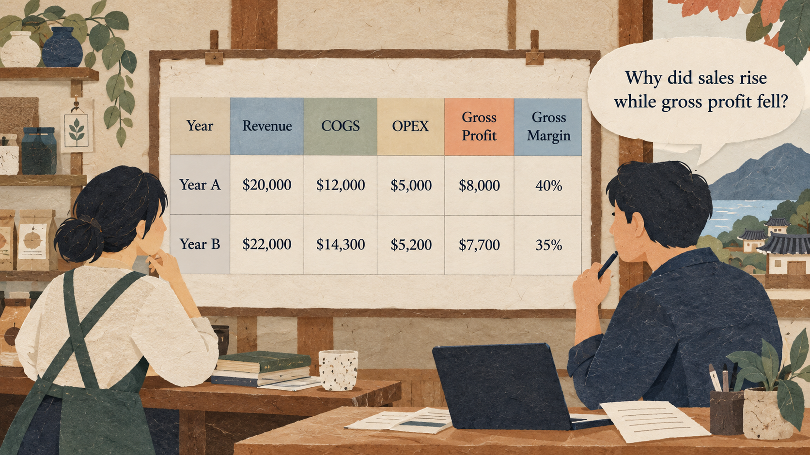

* **Lecture Presentation:** [Download Slides (PDF)](slides/session_3_1_lecture.pdf)

- **Duration:** 3 hours: 50-minute lesson, 10-minute break, 50-minute guided practice, 10-minute break, 50-minute applied practice, and 10-minute wrap-up.
- **Problem:** Sales can rise while the money left after direct costs falls. A manager needs to explain the change without confusing sales, direct costs, and overhead.
- **Goal:** Calculate gross profit and gross margin, check the arithmetic, and write a short evidence-based briefing.
- **Practice data (fictional shop):** Year A: revenue $20,000; cost of goods sold (COGS) $12,000; operating expenses (OPEX) $5,000. Year B: revenue $22,000; COGS $14,300; OPEX $5,200. COGS is the direct cost of goods sold; OPEX is the cost of running the business outside those direct costs.
- **Core concepts:**
  - Gross profit = revenue − COGS. Gross margin = gross profit ÷ revenue × 100.
  - Gross margin describes the share of sales left after direct product costs; it is not the same as final net profit.
  - Separate reported figures (facts) from explanations of why they changed (hypotheses). These figures alone do not identify the cause.
  - Use a calculator or spreadsheet to verify arithmetic; use AI to organize and explain checked figures.
- **Three-step method:** Calculate each year’s gross profit and margin; compare the figures and label facts versus possible explanations; write a brief that names one question to investigate next.
- **Prompt examples for the same case:**
  - Poor 1: “Is this shop doing well? Tell me what to do.” No metric, comparison, or evidence boundary is specified.
  - Poor 2: “Prove that higher sales mean the business is more profitable.” It assumes a conclusion the figures may not support.
  - Good 1: “Using only the four figures for Year A and Year B below, calculate gross profit and gross margin. Show the formula and arithmetic. Do not call gross profit net profit.”
  - Good 2: “Use these checked results: Year A gross profit $8,000 and margin 40%; Year B gross profit $7,700 and margin 35%. Write a 100-word manager brief: state two facts, one possible explanation labeled as unverified, and one follow-up question. Do not invent a cause.”
- **Exercise 1 — Guided calculation:** Calculate gross profit and gross margin for both years with the formulas above. Check: Year A = $8,000 and 40%; Year B = $7,700 and 35%. Compare your answers with AI, then correct any mismatch yourself.
- **Exercise 2 — Applied brief:** In pairs, write a short briefing for a store manager. Explain that revenue increased by $2,000 while gross profit decreased by $300 and margin fell by 5 percentage points. Suggest one additional piece of information to investigate; do not claim to know the cause.
- **Deliverable:** A two-row calculation table and a 100-word manager brief with facts, an explicitly unverified explanation, and a follow-up question.
- **Success check:** Both calculations are correct, gross margin is not mislabeled as net profit, and the brief does not present a guess as a fact.

#### Session 3.2: Operations & Process Improvement

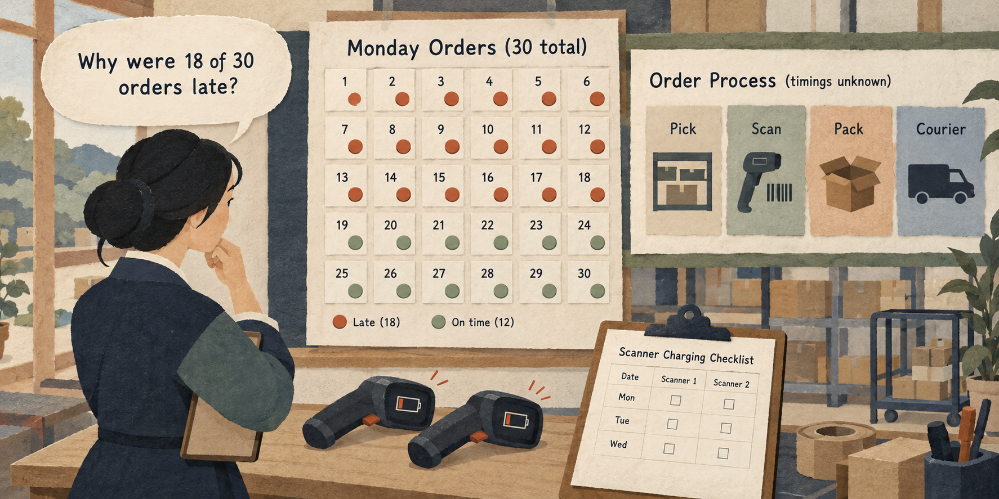

* **Lecture Presentation:** [Download Slides (PDF)](slides/session_3_2_lecture.pdf)

- **Duration:** 3 hours: 50-minute lesson, 10-minute break, 50-minute guided practice, 10-minute break, 50-minute applied practice, and 10-minute wrap-up.
- **Problem:** A small warehouse shipped 18 of 30 orders late on Monday. Staff report that two barcode scanners ran out of battery, but the manager does not yet know whether this explains every delay.
- **Goal:** Map a simple process, distinguish evidence from assumptions, and propose a small test of a likely process cause.
- **Practice facts:** Orders are picked, scanned, packed, then handed to a courier. Two scanners were uncharged at opening. The charging checklist was blank for three days. No timing data by step is available.
- **Core concepts:**
  - A bottleneck is the step that currently limits flow; find it with timing or queue evidence, not a guess.
  - The 5 Whys asks why a problem occurred repeatedly, but each answer is a hypothesis until checked.
  - Focus on process conditions and safeguards, not blame. One observation may not explain all late orders.
- **Three-step method:** State the measurable problem; build a short cause chain and label evidence versus unknowns; choose a low-risk test and a measure.
- **Prompt examples for the same case:**
  - Poor 1: “Who caused all these late orders?” It presumes individual fault and invites unsupported blame.
  - Poor 2: “Do five whys and tell me the root cause.” It asks AI to treat guesses as established facts.
  - Good 1: “Use only the facts below. List what is observed, what is unknown, and up to three possible causes of late orders. Mark each cause as a hypothesis; do not assign blame.”
  - Good 2: “For the hypothesis that uncharged scanners slowed picking, propose a one-week test. Specify the daily measure, comparison, and a result that would weaken this hypothesis. Do not assume it explains all 18 late orders.”
- **Exercise 1 — Guided cause map:** Ask AI to list evidence, unknowns, and possible causes. Draw a simple chain from uncharged scanners to a possible picking delay. Mark every unverified link with “to check.”
- **Exercise 2 — Applied process test:** Draft a one-week opening checklist test. Record scanner charge status and late orders daily; compare with the previous week if reliable records exist. State why the result can suggest but not prove causation.
- **Deliverable:** A one-page cause map and a test plan with a measure, time period, and limitation.
- **Success check:** The response separates observations from hypotheses, avoids blaming workers, and defines a measurable test.

#### Session 3.3: HR & Workplace Communication

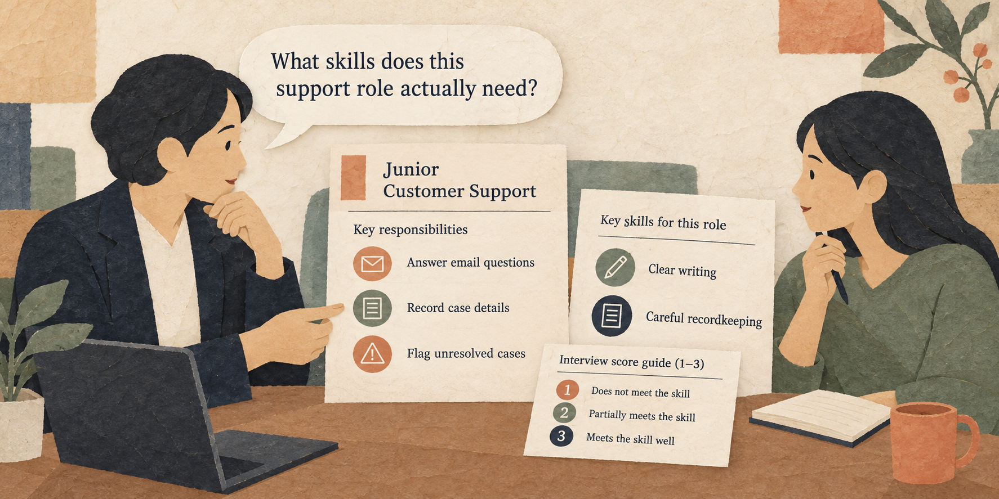

* **Lecture Presentation:** [Download Slides (PDF)](slides/session_3_3_lecture.pdf)

- **Duration:** 3 hours: 50-minute lesson, 10-minute break, 50-minute guided practice, 10-minute break, 50-minute applied practice, and 10-minute wrap-up.
- **Problem:** A vague job ad can deter qualified applicants and leave interviewers evaluating personality rather than the work the role requires.
- **Goal:** Turn real duties into clear job requirements and consistent, job-related interview questions.
- **Practice facts:** A junior customer-support assistant answers email questions, records case details in a spreadsheet, and flags unresolved cases to a supervisor. Required: clear writing and careful recordkeeping. Not required: a specific degree or years of experience.
- **Core concepts:**
  - A competency is a skill demonstrated through work, such as writing a clear reply or recording accurate case details.
  - Prefer observable requirements over vague labels such as “rockstar,” “natural communicator,” or “fast-paced culture.”
  - A structured interview asks each applicant the same job-related question and uses the same criteria.
  - STAR means Situation, Task, Action, Result: a way to ask for a concrete example, not a guarantee of job performance.
- **Three-step method:** Extract duties and necessary skills; draft plain-language requirements; create a shared question and simple evidence-based scoring guide.
- **Prompt examples for the same role:**
  - Poor 1: “Write an exciting ad for a superstar who can do everything.” It offers no job evidence and relies on vague language.
  - Poor 2: “Find someone young, energetic, and a perfect culture fit.” These are vague and may encourage unfair screening.
  - Good 1: “Use only the duties and requirements below. Draft a concise junior job ad with three duties and three observable skills. Do not add degree, experience, age, or personality requirements.”
  - Good 2: “Write one structured interview question about handling an unresolved customer email. Give a 1–3 guide: 1 = no clear steps; 2 = describes a reasonable response; 3 = explains response, accurate case notes, and when to escalate. Apply the same guide to every candidate.”
- **Exercise 1 — Guided job ad:** Generate a short ad from the supplied facts. Highlight each requirement and point to the duty that supports it. Remove any unsupported qualification or vague personality label.
- **Exercise 2 — Applied interview:** Ask a partner the same question: “Tell me about a time you had to respond carefully when you did not know the answer.” Score only the stated steps using the shared guide; do not score accent, confidence, or similarity to yourself.
- **Deliverable:** A short job ad, one structured interview question, and a three-level scoring guide.
- **Success check:** Every requirement maps to a supplied duty, and the interview score is based on job-related evidence.

#### Session 3.4: Workplace AI Ethics, Privacy & Bias

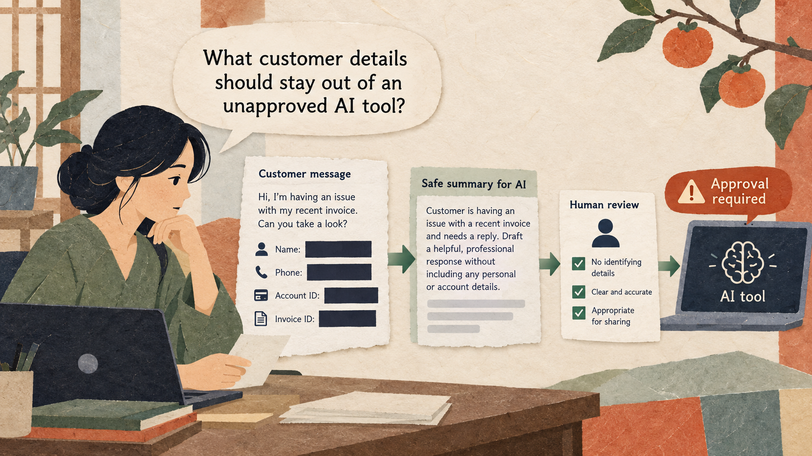

* **Lecture Presentation:** [Download Slides (PDF)](slides/session_3_4_lecture.pdf)

- **Duration:** 3 hours: 50-minute lesson, 10-minute break, 50-minute guided practice, 10-minute break, 50-minute applied practice, and 10-minute wrap-up.
- **Problem:** An employee wants AI to draft a customer response, but the source message contains identifying and account information that should not be pasted into an unapproved tool.
- **Goal:** Identify sensitive information, minimize or replace it when permitted, and check workplace rules before using AI.
- **Practice message (fictional):** “Mina Park, account 84721, called 555-0184 about invoice 3029. She says the package arrived damaged and asks what to do.” Treat names, phone numbers, and account or invoice identifiers as sensitive for this exercise.
- **Core concepts:**
  - Personal or confidential data can include names, contact details, account IDs, health details, employee records, and internal business information.
  - Removing a name may not anonymize information if other details still identify a person.
  - Follow your organization’s approved-tool and data-handling rules. If the rule is unknown, do not upload the data; ask the responsible person.
  - Human review is still needed: check facts, policy, tone, and whether the response exposes private details.
- **Three-step method:** Identify what is sensitive; check whether the tool and task are approved; minimize data and review the output before use.
- **Prompt examples for the same case:**
  - Poor 1: “Here is Mina’s phone and account number. Write a reply.” It unnecessarily shares identifiers.
  - Poor 2: “I removed her name, so this is definitely anonymous; decide whether she deserves compensation.” It overstates anonymization and asks for an unsupported decision.
  - Good 1: “Before using AI, list the data fields in this sample that should be removed or replaced. Do not draft a reply or repeat the identifiers.”
  - Good 2: “Assume company policy permits an approved AI tool for this task. Draft a neutral reply using only: item arrived damaged; customer asks for next steps. Ask the customer to use the secure support channel to provide order details. Do not promise a refund or repeat identifying information.”
- **Exercise 1 — Guided data check:** Mark each sensitive field in the practice message. Create a minimized version that says only “customer reports a damaged package and requests next steps.” Note that this classroom exercise does not authorize uploading real customer data.
- **Exercise 2 — Applied response:** Using only the minimized description and the assumption that the tool is approved, draft a short reply that directs the customer to the secure support channel. Review it for invented policy promises and private details.
- **Deliverable:** A marked-up data minimization example, safe prompt, and human-review checklist.
- **Success check:** No unnecessary identifier is included, tool approval is treated as a required check, and the draft makes no unsupported promise.

### Module 4: Everyday Workflows & Your AI Portfolio

Module 4 turns useful one-off prompts into repeatable work habits. Students learn to make templates, test missing-information cases, choose useful prompts, and document a small portfolio that another person can safely use.

#### Session 4.1: Streamlining Recurring Workflows

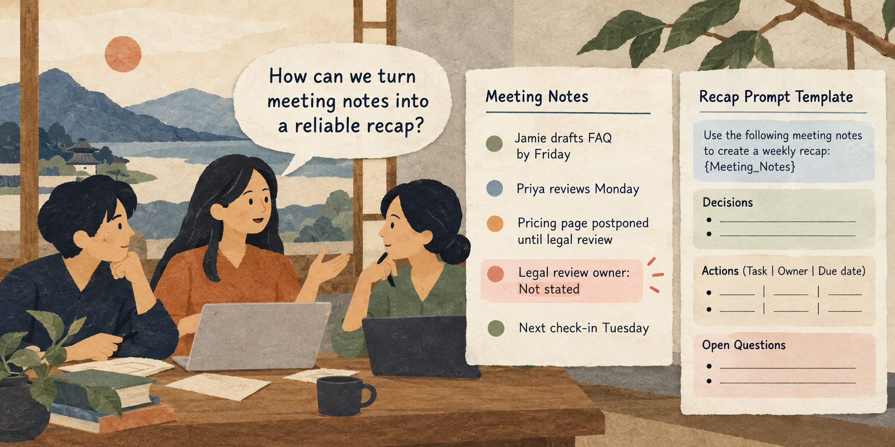

* **Lecture Presentation:** [Download Slides (PDF)](slides/session_4_1_lecture.pdf)

- **Duration:** 3 hours: 50-minute lesson, 10-minute break, 50-minute guided practice, 10-minute break, 50-minute applied practice, and 10-minute wrap-up.
- **Problem:** A team rewrites the same weekly meeting recap from scratch, so important decisions and action owners are easy to miss.
- **Goal:** Build a reusable prompt with clear input fields and a consistent output format.
- **Practice notes (fictional):** “Website FAQ update: Jamie drafts by Friday. Priya reviews Monday. Team agreed to postpone the pricing page until legal review. No owner named for legal review. Next check-in Tuesday.”
- **Core concepts:**
  - A reusable template separates fixed instructions from changing inputs.
  - Placeholders such as `{Meeting_Notes}` show where a user inserts new material.
  - A useful output format states what fields to include and how to handle missing details.
  - Reuse saves setup time, but each output still needs review against the source notes.
- **Three-step method:** Define the repeated task and audience; add named input placeholders and output fields; test the template and compare its claims with the input.
- **Prompt examples for the same notes:**
  - Poor 1: “Summarize this.” It does not say what information the team needs.
  - Poor 2: “Make a complete action plan and assign owners.” It may invent assignments that are not in the notes.
  - Good 1: “From `{Meeting_Notes}`, list decisions, actions, named owners, and dates. If a field is absent, write ‘Not stated.’ Do not infer an owner or deadline.”
  - Good 2: “Format the result as: Decisions; Action | Owner | Due date; Open questions. Keep names and dates exactly as stated. End with one item needing confirmation.”
- **Exercise 1 — Guided template:** Turn the supplied notes into the four output sections using Good 1 and Good 2. Check that Jamie owns the draft, Priya reviews it, and legal review has no named owner.
- **Exercise 2 — Applied workflow:** Replace the notes with a new short set from your group’s class-planning discussion. Reuse the same template; change only the input. Compare whether the output remains readable and faithful.
- **Deliverable:** A reusable prompt card with placeholders, output schema, and one tested result.
- **Success check:** The template handles missing fields explicitly and does not invent an owner, decision, or date.

#### Session 4.2: Troubleshooting & Polishing Prompts

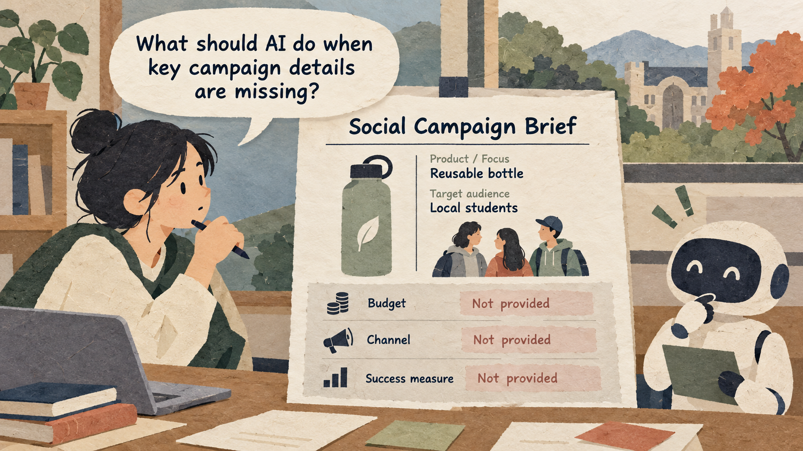

* **Lecture Presentation:** [Download Slides (PDF)](slides/session_4_2_lecture.pdf)

- **Duration:** 3 hours: 50-minute lesson, 10-minute break, 50-minute guided practice, 10-minute break, 50-minute applied practice, and 10-minute wrap-up.
- **Problem:** A campaign prompt can produce a polished plan even when the budget or audience is missing. A confident-looking guess can mislead the team.
- **Goal:** Test a prompt with complete and incomplete inputs, then add a useful fallback for missing information.
- **Practice request:** “Plan a two-week social campaign for a new reusable bottle. We want more local students to learn about it.” Budget, channel, and success measure are not specified.
- **Core concepts:**
  - A required input is information needed to make a responsible recommendation.
  - A fallback tells the model what to do when that input is absent: ask, label an assumption, or provide only a limited draft.
  - Test the same prompt with normal and incomplete cases so you can see what the change actually improves.
  - Avoid asking for needless clarification when a safe, useful partial answer is possible.
- **Three-step method:** Run a baseline prompt; note any invented or unclear detail; add one fallback rule and rerun the same case.
- **Prompt examples for the same request:**
  - Poor 1: “Create the perfect campaign.” It hides missing inputs and gives no evaluation criteria.
  - Poor 2: “Assume a $10,000 budget and promise strong sales.” It invents a budget and outcome.
  - Good 1: “List the known campaign facts and the missing details. Do not invent a budget, channel, or performance result. Ask up to three questions that would materially change the plan.”
  - Good 2: “Draft a low-cost planning outline using only the known facts. Mark budget, channel, and success measure as ‘To confirm’; do not recommend spending or claim expected sales. End with the three questions needed before launch.”
- **Exercise 1 — Guided bug check:** Run Poor 1 on the practice request. Record any invented details. Run Good 1 and compare whether it identifies the same gaps without pretending to know the answers.
- **Exercise 2 — Applied patch:** Add a budget of $300 and a goal of 100 local page visits; keep the channel unspecified. Revise the prompt so AI can suggest channel options but marks them as choices to approve, not settled facts.
- **Deliverable:** A before/after prompt pair and a test log noting missing inputs, model behavior, and the improvement.
- **Success check:** The patched prompt neither invents missing facts nor blocks a limited, clearly labeled planning draft.

#### Session 4.3: Reviewing & Selecting Your Best Prompts

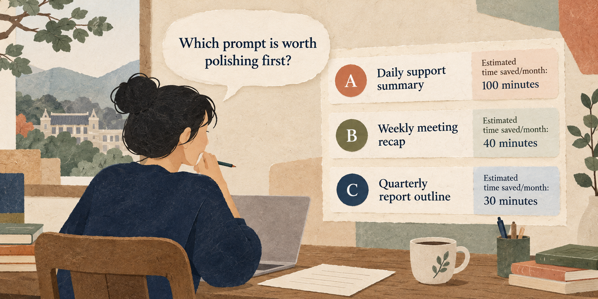

* **Lecture Presentation:** [Download Slides (PDF)](slides/session_4_3_lecture.pdf)

- **Duration:** 3 hours: 50-minute lesson, 10-minute break, 50-minute guided practice, 10-minute break, 50-minute applied practice, and 10-minute wrap-up.
- **Problem:** A student has several prompts but limited time to polish and present them. Choosing by novelty alone can overlook a simple prompt that solves a frequent task.
- **Goal:** Compare candidate prompts using practical value, reuse, output quality, and a modest time-saved estimate.
- **Practice candidates (fictional estimates):** A: format a daily 10-minute support summary, used 20 times/month; B: draft a weekly 20-minute meeting recap, used 4 times/month; C: outline a quarterly 60-minute report, used once/month. Estimate each saves half the original time: A saves 5 minutes/use, B 10, C 30.
- **Core concepts:**
  - Monthly time saved = minutes saved per use × monthly uses. These are estimates to test, not guaranteed savings.
  - Consider usefulness, repeat frequency, consistency, ease of reuse, and the cost of an error.
  - A high score does not remove the need to test a prompt on fresh examples.
- **Three-step method:** Estimate time saved; score prompts against shared criteria; select one to improve and explain the trade-off.
- **Prompt examples for the same candidates:**
  - Poor 1: “Which prompt is the coolest?” It substitutes novelty for usefulness.
  - Poor 2: “Pick the highest-scoring one and say it will save money.” It treats rough time estimates as proof of financial return.
  - Good 1: “For each candidate, calculate estimated minutes saved per month from the figures below. Show the multiplication and label results as estimates.”
  - Good 2: “Compare the three prompts on usefulness, repeat frequency, consistency, ease of reuse, and error risk (low/medium/high). Recommend one to polish first and state one reason not to choose each alternative. Do not claim measured savings.”
- **Exercise 1 — Guided comparison:** Calculate A = 100 minutes/month, B = 40, C = 30. Score each from 1–3 on usefulness and ease of reuse; add an error-risk note. Discuss why estimated time alone is not the whole decision.
- **Exercise 2 — Applied selection:** Bring two prompts from earlier sessions. Have a partner test each with a new input, record one quality issue, and choose which prompt is most ready to document.
- **Deliverable:** A comparison table, calculations, and a short recommendation with a caveat.
- **Success check:** The time calculations are correct, estimates are labeled, and the recommendation considers quality and risk as well as frequency.

#### Session 4.4: Building Your Professional Prompt Portfolio

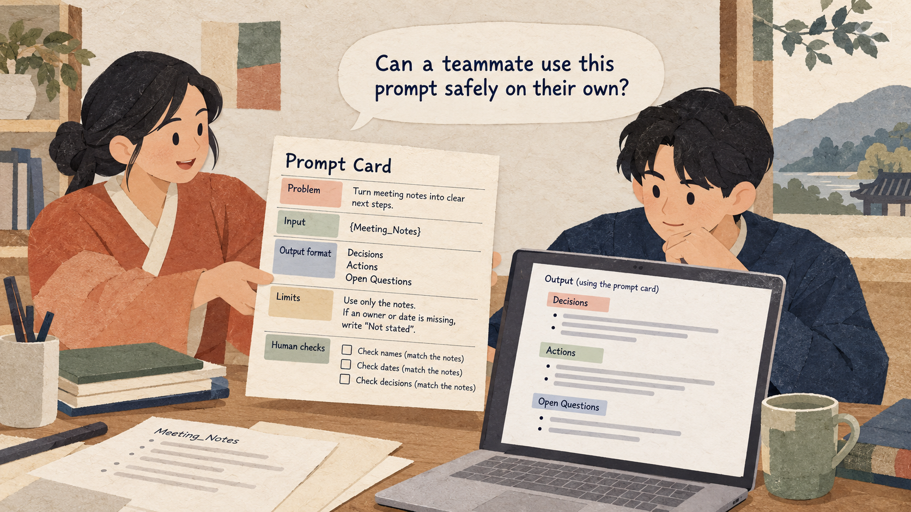

* **Lecture Presentation:** [Download Slides (PDF)](slides/session_4_4_lecture.pdf)

- **Duration:** 3 hours: 50-minute lesson, 10-minute break, 50-minute guided practice, 10-minute break, 50-minute applied practice, and 10-minute wrap-up.
- **Problem:** A useful prompt buried in a chat is difficult for a teammate to reuse, understand, or check safely.
- **Goal:** Document one tested prompt clearly enough that another person can use it and recognize when human review is required.
- **Practice task:** Convert meeting notes into a concise team recap. A good recap must separate decisions from actions and must not invent a missing owner or deadline.
- **Core concepts:**
  - A prompt card records the problem, user, inputs, prompt, expected output, limits, and verification steps.
  - Placeholders make changing details visible; example inputs show how to fill them.
  - A boundary states when not to use the prompt or when to stop and ask a person.
  - A portfolio should show a tested artifact and what the student learned, not claim that AI output is automatically correct.
- **Three-step method:** Choose one prompt that solves a real repeated task; document inputs, instructions, and boundaries; have a classmate test and review it.
- **Prompt examples for the same task:**
  - Poor 1: “Here’s my prompt: summarize meetings.” It lacks inputs, format, and review guidance.
  - Poor 2: “Use AI to assign every task to the most likely person.” It invites invented ownership.
  - Good 1: “From `{Meeting_Notes}`, list decisions and actions. For each action include only a stated owner and date; use ‘Not stated’ when absent.”
  - Good 2: “Return sections Decisions, Actions (Task | Owner | Due date), and Open questions. Keep wording faithful to the notes. A human must compare names, dates, and decisions with the source before sharing.”
- **Exercise 1 — Guided prompt card:** Complete the fields: task/problem, intended user, required input, reusable prompt, output format, do-not-use condition, and three verification checks. Test it on the supplied meeting notes from Session 4.1.
- **Exercise 2 — Applied peer handoff:** Give the card to a classmate without explaining it verbally. They run it on a new short set of notes and mark confusing instructions, missing safeguards, and any output error. Revise the card once.
- **Deliverable:** One tested prompt card with a sample input/output, boundaries, and a human-review checklist.
- **Success check:** A classmate can use the card without extra explanation, missing fields remain visible, and the review checklist catches source mismatches.

<!-- Superseded legacy Module 3–4 session content retained in source for reference.

#### Session 3.1: Financial Analysis & Executive Briefs


* **Lecture Presentation:** [Download Slides (PDF)](slides/session_3_1_lecture.pdf)

- **Duration:** 3 Hours (180 minutes)
  - *Hour 1 (50 min):* Comprehensive Concept Lecture & Live Demonstration
  - *Hour 2 (50 min):* Guided Hands-On Lab (Basic Exercise: 2-Year Financial Margin Audit)
  - *Hour 3 (50 min):* Applied Business Challenge & Peer Debrief (Advanced Exercise: Inflation Sensitivity & Cost Absorption Model)
- **Goal:** Turn financial numbers and profit margins into clear, simple summaries for non-finance managers.
- **Lecture Content (Hour 1 - 50 Minutes):**
  - **Part 1: The 4 Core Financial Metrics in Business Management (15 min):**  
    Explain the financial chain in plain language:
    - *Total Revenue:* The top-line sales dollars entering the company.
    - *Cost of Goods Sold (COGS):* Direct expenses required to produce goods (raw materials, factory labor).
    - *Gross Profit Margin:* `(Revenue - COGS) / Revenue` - the fundamental indicator of production efficiency.
    - *Operating Expenses (OPEX):* Overhead required to run the company (R&D, marketing, executive salaries, office rent).
  - **Part 2: Executive Translation - Storytelling with Financial Data (15 min):**  
    Department heads and store managers often do not have finance degrees. Business AI communication must translate changes in margin percentages into concrete operational stories (e.g., *"Our sales grew 10%, but freight costs grew 25%, causing our net profit to decline"*).
  - **Part 3: Guardrails for AI Financial Calculations (10 min):**  
    Never ask AI: *"Is our company healthy?"* (too subjective). Always provide the raw financial figures and demand explicit mathematical formulas: *"Calculate Gross Margin as (Revenue - COGS)/Revenue and display the intermediate fraction."*

    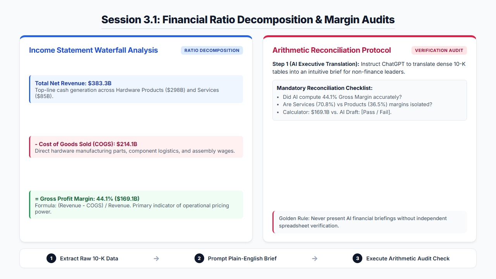

  - **Part 4: Instructor Live Demonstration Script & Discussion (10 min):**  
    *Live Demo:* Pull up Apple's 10-K income statement on Yahoo Finance. Input the numbers into ChatGPT and request a 150-word executive briefing for retail store managers. Calculate the Gross Margin percentage on a calculator live to demonstrate whether the AI rounded or made an error.  
    *Discussion Question:* *"Why should a non-finance business manager understand the difference between Gross Margin and Operating Expense?"* (Answer: Because cutting OPEX requires administrative changes, whereas fixing Gross Margin requires renegotiating supplier contracts or raising product prices).
- **Public Data Source:** [Yahoo Finance Apple Inc. (AAPL) Financials](https://finance.yahoo.com/quote/AAPL/financials/) - Free, publicly accessible corporate income statement with real revenue, cost, and profit figures.
- **Reference:** [Deloitte: The CFO Guide to Generative AI (Financial Planning & Analysis)](https://www.deloitte.com/global/en/services/consulting/perspectives/cfo-generative-ai.html) - How corporate finance teams use Gen AI for 10-K analysis and executive briefs while enforcing arithmetic audit checklists.
- **Prompt Comparison:**
  - **Weak Prompt Example (Vague & Unstructured):**
    ```text
    Is Apple doing well financially based on these numbers? What should we do?
    ```
    *Why it fails:* Prompts for subjective opinions, causing ChatGPT to produce generic investment hype without verifying margins or distinguishing production costs from operating overhead.
  - **Strong Prompt Example (Quantitative Guardrails & Plain-English Translation):**
    ```text
    You are a Senior Financial Analyst preparing an executive briefing for non-finance retail store managers.

    Financial Data:
    - Year 1: Total Revenue = $383,285M; Cost of Goods Sold = $214,137M; Operating Expenses = $54,847M
    - Year 2: Total Revenue = $394,328M; Cost of Goods Sold = $220,684M; Operating Expenses = $57,000M

    Execute the following instructions:
    1. Calculate Gross Profit Margin for both years using the formula: (Total Revenue - COGS) / Total Revenue. Show the exact calculation steps and resulting percentages rounded to one decimal.
    2. In a 150-word executive briefing written in plain English with zero financial jargon, explain whether profit margin improvements came from manufacturing efficiency or operating cost controls.
    3. Include a warning note reminding the reader that automated calculations must be reconciled against audited 10-K filings.
    ```
    *Why it succeeds:* Enforces explicit mathematical formulas, bounds the briefing length, and translates raw accounting numbers into operational management takeaways.
- **How to Practice:**
  1. **Step 1:** Open the Yahoo Finance financials page for Apple Inc. Click on the "Income Statement" tab.
  2. **Step 2:** Find and copy the numbers for Total Revenue, Cost of Revenue, and Operating Expenses for the two most recent annual periods.
  3. **Step 3:** In ChatGPT, enter: *"Here are Apple's revenue and expense numbers for the past two years: [Paste numbers]. Please: (1) Calculate the Gross Profit Margin percentage for each year, and (2) Write a 150-word executive briefing explaining whether operational costs increased or decreased, written in plain English for a retail store manager."*
  4. **Step 4:** Double-check ChatGPT's gross margin math with a calculator: `(Total Revenue - Cost of Revenue) / Total Revenue`. Record your findings in the Financial Review Table.
- **What to Expect:** An easy-to-read explanation of financial performance, along with points where you must double-check the calculations.
- **Exercise 1 (Basic - 2-Year Financial Margin Audit):**
  - Scenario: Using the Yahoo Finance Apple Inc. (AAPL) income statement dataset from this session, extract Total Revenue, Cost of Revenue, and Operating Expenses for the two most recent annual periods.
  - Task: Engineer a prompt instructing ChatGPT to calculate Gross Profit Margin `(Revenue - COGS) / Revenue` for both years with step-by-step math, and draft a 150-word plain-English explanation for non-finance retail store managers. Manually verify the arithmetic using a calculator.
  - Deliverable: Completed Financial Review Table documenting reported figures, manual calculation checks, AI plain-English summary, and management takeaways.
- **Exercise 2 (Advanced - Inflation Sensitivity & Cost Absorption Model):**
  - Scenario: Using the exact same Apple Inc. financial dataset, conduct a strategic sensitivity stress test: assume global component manufacturing costs increase by 8% next year due to tariff changes, while consumer market resistance prevents Apple from increasing retail prices.
  - Task: Prompt ChatGPT as a Senior Financial Planning & Analysis (FP&A) Consultant. Instruct the model to calculate the projected dollar impact on Gross Margin, evaluate whether Operating Expenses (R&D and SG&A) can absorb the contraction, and draft a 200-word strategic decision brief for the executive committee recommending whether to absorb the cost or adjust product tier pricing.
  - Deliverable: An Executive Inflation Sensitivity Brief containing projected margin impact calculations and a cost absorption trade-off matrix.

#### Session 3.2: Operations & Process Improvement


* **Lecture Presentation:** [Download Slides (PDF)](slides/session_3_2_lecture.pdf)

- **Duration:** 3 Hours (180 minutes)
  - *Hour 1 (50 min):* Comprehensive Concept Lecture & Live Demonstration
  - *Hour 2 (50 min):* Guided Hands-On Lab (Basic Exercise: 5-Whys Warehouse Delay Diagnostic)
  - *Hour 3 (50 min):* Applied Business Challenge & Peer Debrief (Advanced Exercise: Cross-Functional FMEA Risk Analysis)
- **Goal:** Find operational bottlenecks and explore root causes using simple problem-solving tools.
- **Lecture Content (Hour 1 - 50 Minutes):**
  - **Part 1: Operational Bottlenecks & The Theory of Constraints (15 min):**  
    In manufacturing and service operations, Eliyahu Goldratt's Theory of Constraints states that any manageable system is limited in achieving more of its goals by at least one constraint (the bottleneck). Increasing speed anywhere other than the bottleneck is an illusion.
  - **Part 2: The Toyota 5-Whys Diagnostic Methodology (15 min):**  
    Developed by Sakichi Toyoda, the 5-Whys technique resolves operational problems by repeatedly asking "Why?" 5 times. This pushes past superficial symptoms (e.g., *"The driver was late"*) down to systemic management failures (e.g., *"The maintenance scheduling software lacked automated reminders"*).
  - **Part 3: Auditing AI Causal Reasoning (10 min):**  
    AI often makes "logical leaps" when doing root-cause analysis (e.g., jumping from a late delivery directly to *"the CEO lacks vision"*). Business analysts must audit each causal link: Is this a *Strong Link* (empirically probable), a *Logical Leap* (unproven jump), or *Superficial* (blaming individuals instead of systems)?

    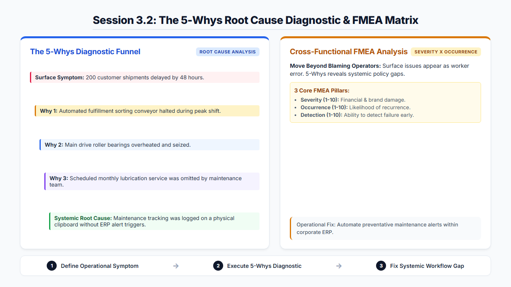

  - **Part 4: Instructor Live Demonstration Script & Discussion (10 min):**  
    *Live Demo:* Present an operational crisis: An e-commerce warehouse had 500 delayed shipments during Black Friday. Run a 5-Whys analysis in ChatGPT. Show how each "Why" uncovers a deeper process flaw (Barcode scanner battery failures -> No charging dock SOP).  
    *Discussion Question:* *"Why do bad managers stop at Why #1 or #2, and what are the consequences?"* (Answer: They blame employee carelessness and fire workers, but the underlying system failure remains, causing the exact same mistake to happen again).
- **Public Data Source:** [Five Whys Root Cause Analysis (Wikipedia)](https://en.wikipedia.org/wiki/Five_whys) - Classic problem-solving framework with real manufacturing and operational examples.
- **Reference:** [McKinsey & Company / WEF: Global Lighthouse Network in Operations](https://www.mckinsey.com/capabilities/operations/our-insights/global-lighthouse-network) - Case studies of global facilities resolving operational bottlenecks and applying 5-Whys root cause analysis.
- **Prompt Comparison:**
  - **Weak Prompt Example (Vague & Unstructured):**
    ```text
    Why were our warehouse shipments delayed by 3 days during the holiday rush?
    ```
    *Why it fails:* ChatGPT will guess superficial reasons ("workers were tired", "the manager didn't plan ahead") without investigating underlying system constraints.
  - **Strong Prompt Example (Toyota 5-Whys Root Cause Protocol):**
    ```text
    You are a Lean Six Sigma Operations Director.
    Problem Statement: An e-commerce fulfillment warehouse experienced a 3-day shipping backlog affecting 500 customer orders during Black Friday.

    Conduct a rigorous Toyota 5-Whys diagnostic following these rules:
    - At each "Why" level, state the direct physical/operational failure, then ask the next logical question.
    - Rule: Do NOT blame individuals (e.g., "workers were careless"). Focus strictly on equipment, software, training, and standard operating procedures (SOPs).
    - Causal Audit: For each link, classify the logic as [Strong Empirical Link] or [Logical Leap to be Verified].
    - Final Outcome: Identify the systemic root cause at Why #5 and propose 2 permanent, low-cost preventive safeguards to install before next quarter.
    ```
    *Why it succeeds:* Restricts causal reasoning to systemic processes rather than employee blame, auditing each logical link to prevent superficial conclusions.
- **How to Practice:**
  1. **Step 1:** Review the 5-Whys methodology and the classic factory breakdown example on the public Wikipedia page.
  2. **Step 2:** Create an operational problem statement: *"An online retail warehouse experienced a 3-day shipping delay for 500 customer orders during the holiday sale."*
  3. **Step 3:** In ChatGPT, enter: *"Act as an Operations Manager. Conduct a rigorous 5-Whys root cause analysis on this delay. At each 'Why' level, identify the direct operational failure and ask the next logical question until reaching the system-level root cause."*
  4. **Step 4:** Evaluate each of the 5 reasoning levels. Mark each link as a *Strong Link*, a *Weak Link*, or *Unrealistic* in your 5-Whys Diagnostic Table.
- **What to Expect:** Discover whether the AI's explanation makes practical business sense or makes illogical jumps.
- **Exercise 1 (Basic - 5-Whys Warehouse Delay Diagnostic):**
  - Scenario: Based on the Five Whys Root Cause Analysis framework from this session, examine an operational crisis where an e-commerce fulfillment center experienced a 3-day backlog affecting 500 customer shipments.
  - Task: Formulate a structured prompt instructing ChatGPT to conduct a rigorous 5-Whys analysis focused entirely on standard operating procedures (SOPs), equipment, and software rather than worker blame.
  - Deliverable: Completed 5-Whys Diagnostic Table recording each "Why" step, classifying each causal transition as a *Strong Empirical Link* or *Logical Leap to Verify*, and identifying the systemic root cause.
- **Exercise 2 (Advanced - Cross-Functional FMEA Risk Analysis):**
  - Scenario: Using the exact same warehouse fulfillment failure scenario, expand the systemic root cause identified at Why #5 into a formal Failure Mode and Effects Analysis (FMEA).
  - Task: Prompt ChatGPT as a Lean Six Sigma Operations Director to analyze the ripple effects of this failure across three interconnected departments: Warehouse Logistics, IT Infrastructure, and Customer Support. Instruct the model to calculate a Severity-Occurrence-Detection Risk Priority Number (RPN) for each department and draft a 3-point cross-functional preventive action plan.
  - Deliverable: A Cross-Functional FMEA Matrix with assigned risk priority scores and a preventive operational policy memo.

#### Session 3.3: HR & Workplace Communication


* **Lecture Presentation:** [Download Slides (PDF)](slides/session_3_3_lecture.pdf)

- **Duration:** 3 Hours (180 minutes)
  - *Hour 1 (50 min):* Comprehensive Concept Lecture & Live Demonstration
  - *Hour 2 (50 min):* Guided Hands-On Lab (Basic Exercise: Competency Job Architecture & Redline)
  - *Hour 3 (50 min):* Applied Business Challenge & Peer Debrief (Advanced Exercise: Standardized STAR Interview Scoring Calibration)
- **Goal:** Write clear, fair job postings and interview questions while removing cliché buzzwords.
- **Lecture Content (Hour 1 - 50 Minutes):**
  - **Part 1: Competency-Based Job Architecture (15 min):**  
    Traditional job postings often list vague personality traits (e.g., *"dynamic self-starter"*). Modern HR relies on competency-based architecture: grounding hiring specifications in concrete daily tasks, software tools, and measurable work deliverables.
  - **Part 2: The Hazard of Corporate Buzzwords & Subtle Bias in AI (15 min):**  
    Because LLMs are trained on historical internet job postings, they naturally default to overused clichés (*"rockstar"*, *"ninja"*, *"wear many hats"*). Research shows that masculine-coded or hyper-aggressive words (*"dominant"*, *"work hard play hard"*) discourage qualified female and diverse candidates from applying.
  - **Part 3: Structured Behavioral Interviewing (STAR Method) (10 min):**  
    How to prompt AI to build objective interview rubrics:  
    - **S**ituation: Context of past project.  
    - **T**ask: Goal assigned to candidate.  
    - **A**ction: Specific actions taken by the candidate.  
    - **R**esult: Measurable outcome.  
    Teaching students to attach 1-to-5 point scoring rubrics to eliminate interviewer subjectivity.

    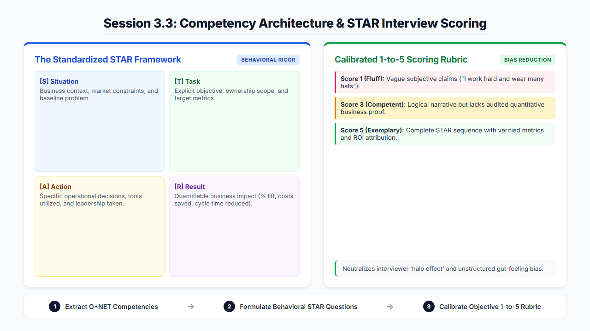

  - **Part 4: Instructor Live Demonstration Script & Discussion (10 min):**  
    *Live Demo:* Pull up the official Market Research Analyst profile on O*NET. Ask ChatGPT for a job posting. Highlight 3 cliché phrases live on the board. Inject negative constraints to eliminate the clichés, and generate a 5-question STAR interview scoring rubric.  
    *Discussion Question:* *"Why do unstructured job interviews lead to poor hiring decisions compared to structured rubrics?"* (Answer: Unstructured interviews favor charismatic talkers who match the interviewer's background, while rubrics evaluate actual job competency).
- **Public Data Source:** [O*NET OnLine Market Research Analyst Profile](https://www.onetonline.org/link/summary/13-1161.00) - Official US Department of Labor database listing daily tasks, skills, and tools for business analysts.
- **Reference:** [Boston Consulting Group (BCG): AI at Work: What People Are Saying, What Employers Should Do](https://www.bcg.com/publications/2023/what-people-are-saying-about-ai-at-work) - Survey across 180 countries on using AI to eliminate bias in job descriptions and maintain structured STAR interviewing.
- **Prompt Comparison:**
  - **Weak Prompt Example (Vague & Unstructured):**
    ```text
    Write an awesome, energetic job posting for a rockstar business analyst who can work hard and wear many hats, and write some interview questions.
    ```
    *Why it fails:* Packed with gender-biased, aggressive clichés ("rockstar", "work hard play hard") that discourage qualified applicants, paired with unstructured, subjective interview questions.
  - **Strong Prompt Example (Competency-Based Job Architecture & STAR Rubric):**
    ```text
    You are an HR Talent Acquisition Specialist committed to objective, inclusive hiring practices.
    Reference: O*NET 13-1161.00 (Market Research Analysts).

    Task 1 - Job Description:
    Write an entry-level job posting grounded in 3 concrete competencies: customer survey analysis, statistical report drafting, and cross-functional team presentations.
    Negative Constraint: Strictly ban clichés and aggressive phrasing ("rockstar", "guru", "ninja", "fast-paced environment", "wear many hats").

    Task 2 - Structured STAR Interview Questions:
    Create 3 behavioral interview questions using the Situation-Task-Action-Result format.
    For Question 1, provide a standardized 1-to-5 scoring rubric:
    - Score 1 (Unsatisfactory): [Vague description of candidate response]
    - Score 3 (Proficient): [Specific description of required candidate response]
    - Score 5 (Exceptional): [Measurable, data-backed candidate response]
    ```
    *Why it succeeds:* Eliminates hiring bias and buzzwords, establishing objective competency requirements and measurable evaluation rubrics.
- **How to Practice:**
  1. **Step 1:** Open the O*NET profile link and copy 3 specific job tasks (e.g., *"Collect and analyze customer opinion data"*).
  2. **Step 2:** In ChatGPT, prompt: *"Write a job posting for an Entry-Level Market Research Analyst based on these 3 tasks: [Paste tasks]. Rule: Do NOT use overused buzzwords like 'rockstar', 'guru', 'fast-paced', or 'self-starter'."*
  3. **Step 3:** Ask a follow-up prompt: *"Generate 3 structured behavioral interview questions to test if a candidate can perform these tasks, including a 1-to-5 point scoring rubric."*
  4. **Step 4:** Review the output for any remaining clichés, subjective criteria, or unfair questions. Fill out the HR Cliché Redline Sheet.
- **What to Expect:** Spot common clichés that AI often repeats and learn how to instruct it to use professional, realistic language.
- **Exercise 1 (Basic - Competency Job Architecture & Redline):**
  - Scenario: Using the O*NET OnLine Market Research Analyst profile (Code 13-1161.00) from this session, select 3 specific occupational tasks and technical tools.
  - Task: Prompt ChatGPT to generate an entry-level job posting using strict negative constraints banning corporate buzzwords ("rockstar", "wear many hats", "guru"). Then draft 3 behavioral interview questions using the STAR framework.
  - Deliverable: Completed HR Cliché Redline Sheet identifying any residual vague phrases, explaining why they induce hiring bias, and demonstrating the prompt constraint used to eliminate them.
- **Exercise 2 (Advanced - Standardized STAR Interview Scoring Calibration):**
  - Scenario: Using the exact same O*NET Market Research Analyst profile and the 3 STAR interview questions generated in Exercise 1, calibrate hiring panel scoring consistency.
  - Task: Prompt ChatGPT to construct two simulated candidate interview responses to Question 1: Candidate A (a charismatic speaker who speaks in generalities with zero quantitative metrics) and Candidate B (a reserved candidate who provides structured STAR details with concrete percentage improvements). Instruct the model to evaluate and score both candidates against a rigorous 1-to-5 scoring rubric with written justifications.
  - Deliverable: An Interview Calibration Scorecard featuring side-by-side candidate transcripts, assigned rubric scores, and an objective hiring panel consensus recommendation.

#### Session 3.4: Workplace AI Ethics, Privacy & Bias


* **Lecture Presentation:** [Download Slides (PDF)](slides/session_3_4_lecture.pdf)

- **Duration:** 3 Hours (180 minutes)
  - *Hour 1 (50 min):* Comprehensive Concept Lecture & Live Demonstration
  - *Hour 2 (50 min):* Guided Hands-On Lab (Basic Exercise: PII Tokenization & Sanitization Audit)
  - *Hour 3 (50 min):* Applied Business Challenge & Peer Debrief (Advanced Exercise: Corporate AI Breach Escalation & Governance Memo)
- **Goal:** Protect private company and customer data when using AI at work.
- **Lecture Content (Hour 1 - 50 Minutes):**
  - **Part 1: Enterprise Data Privacy - What Happens to Your Prompts? (15 min):**  
    Explain the difference between free public AI tiers (where user prompts may be stored and used to train future model versions) and enterprise API tiers (with contractual zero-data-retention agreements). If an employee pastes proprietary financial plans or source code into a public model, that data could potentially leak.
  - **Part 2: Defining Personally Identifiable Information (PII) (15 min):**  
    Review legal and corporate privacy standards (GDPR, CCPA):
    - Direct Identifiers: Customer full names, government IDs, credit card numbers, phone numbers.
    - Indirect / Sensitive Data: Employee salaries, performance reviews, health records, trade secrets.
  - **Part 3: The Tokenization & Sanitization Technique (10 min):**  
    How to safely use AI on sensitive business problems: Replace real identifiers with generic tokens before prompting:  
    `[Client_Name]`, `[Account_01]`, `[City_A]`, `[Fee_$X]`.  
    After ChatGPT generates the response, the human employee simply replaces the tokens with the real data inside company systems.

    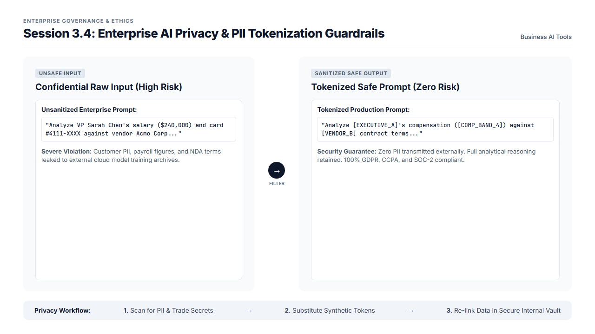

  - **Part 4: Instructor Live Demonstration Script & Discussion (10 min):**  
    *Live Demo:* Open the AI Incident Database. Review the real case of Samsung semiconductor engineers leaking proprietary source code to ChatGPT in 2023. Demonstrate live on screen how to take a confidential medical billing record and sanitize it into a safe, tokenized prompt that delivers the exact same business value without privacy risks.  
    *Discussion Question:* *"If an employee pastes customer credit card numbers into ChatGPT to format a table, who is legally responsible if a data breach occurs?"* (Answer: The employee and their employer, under international privacy laws).
- **Public Data Source:** [AI Incident Database (Public Real Incidents)](https://incidentdatabase.ai/) - Open repository documenting real-world examples of AI privacy breaches, bias, and corporate errors.
- **Reference:** [UNESCO: Recommendation on the Ethics of Artificial Intelligence](https://www.unesco.org/en/artificial-intelligence/recommendation-ethics) - Global standard on corporate data privacy, PII tokenization, human oversight, and bias mitigation.
- **Prompt Comparison:**
  - **Weak Prompt Example (Direct PII Exposure - High Risk):**
    ```text
    Draft a debt collection warning email to our client John Evans (SSN: 042-18-9921, Personal Phone: 555-0199, Salary: $135,000) who owes $6,500 on overdue consulting invoice #INV-8821 for his startup TechFlow Inc.
    ```
    *Why it fails:* Directly violates GDPR, CCPA, and corporate confidentiality policies by pasting real customer names, social security numbers, phone numbers, and salaries into a public model.
  - **Strong Prompt Example (Sanitized & Tokenized Architecture - Safe):**
    ```text
    You are an Accounts Receivable Lead. Draft a firm yet professional 2-paragraph formal payment reminder email based on the tokenized parameters below.

    Client Parameters:
    - Recipient: [Client_Name] at [Company_Name]
    - Overdue Amount: [Total_Balance_Due]
    - Original Invoice Reference: [Invoice_ID]
    - Payment Terms: [Grace_Period_Days] past due date [Invoice_Due_Date]

    Requirements:
    1. Sentence 1: Clearly reference the original invoice number and outstanding balance.
    2. Outline acceptable payment methods using placeholder token: [Insert_Bank_Wire_Details].
    3. Specify a 5-business-day deadline before services are paused.
    4. Tone: Courteous, objective, and firm.
    ```
    *Why it succeeds:* Achieves 100% of the desired business output while zero Personally Identifiable Information (PII) is exposed to the AI model.
- **How to Practice:**
  1. **Step 1:** Open the AI Incident Database and read one summary about employees leaking proprietary code or confidential client data to AI.
  2. **Step 2:** Write down a realistic workplace scenario containing sensitive PII: *"Client: John Evans, Account #88392, Salary: $120,000, owes $4,500 on past due consulting invoices. Write an email reminder."*
  3. **Step 3:** Practice prompt sanitization: rewrite the prompt into a safe, anonymized template replacing private names and numbers with tokens like `[Client_Name]`, `[Account_ID]`, and `[Balance_Due]`.
  4. **Step 4:** Send both versions to ChatGPT to confirm that the sanitized version produces the exact same professional quality email without exposing confidential data. Complete your Privacy Sanitization Table.
- **What to Expect:** Understand how to get helpful business insights from ChatGPT without sharing private or sensitive information.
- **Exercise 1 (Basic - PII Tokenization & Sanitization Audit):**
  - Scenario: Based on corporate data leak case studies from the AI Incident Database, create a realistic business prompt containing sensitive Personally Identifiable Information (PII) such as customer name, account number, debt balance, and telephone number.
  - Task: Engineer a safe tokenized replacement prompt replacing sensitive data with reusable tokens (`[Client_Name]`, `[Invoice_ID]`, `[Outstanding_Balance]`). Run both prompts in ChatGPT to prove that the sanitized version delivers identical business quality without data leakage.
  - Deliverable: Completed Privacy Sanitization Table comparing the raw prompt against the sanitized prompt, classifying privacy risk levels (*Low / Medium / High*), and documenting the token substitution key.
- **Exercise 2 (Advanced - Corporate AI Breach Escalation & Governance Memo):**
  - Scenario: Using the exact same debt collection scenario from Exercise 1, assume a new marketing intern inadvertently pasted raw, un-sanitized client financial data and personal identification numbers into a public, free-tier AI model, violating company data governance policies.
  - Task: Prompt ChatGPT as a Corporate Data Privacy & Compliance Officer. Formulate a 4-step emergency incident response plan (containment, risk assessment, client notification determination, and audit logging) and draft a 1-page Departmental AI Acceptable Use Policy memo establishing mandatory tokenization protocols for all team members.
  - Deliverable: An Incident Escalation & AI Data Governance Memo containing the breach impact analysis and mandatory workplace AI compliance rules.

---

### Module 4: Everyday Workflows & Your AI Portfolio

#### Session 4.1: Streamlining Recurring Workflows


* **Lecture Presentation:** [Download Slides (PDF)](slides/session_4_1_lecture.pdf)

- **Duration:** 3 Hours (180 minutes)
  - *Hour 1 (50 min):* Comprehensive Concept Lecture & Live Demonstration
  - *Hour 2 (50 min):* Guided Hands-On Lab (Basic Exercise: Standardized Meeting SOP Template)
  - *Hour 3 (50 min):* Applied Business Challenge & Peer Debrief (Advanced Exercise: Multi-Department Briefing Distribution SOP)
- **Goal:** Turn repetitive weekly office tasks into reusable prompt templates with fill-in-the-blank placeholders.
- **Lecture Content (Hour 1 - 50 Minutes):**
  - **Part 1: Standard Operating Procedures (SOPs) as Reusable Prompts (15 min):**  
    Most administrative office work is repetitive: weekly status emails, customer onboarding updates, sales recap memos. Instead of prompting AI from scratch each time, high-performing professionals build standardized prompt templates that can be executed in under 60 seconds.
  - **Part 2: Designing Dynamic Variable Placeholders (15 min):**  
    Teach parameter architecture using `{curly_bracket}` placeholders:
    - `{Meeting_Date}`
    - `{Attendees}`
    - `{Unstructured_Notes}`
    - `{Action_Item_Owners}`  
    Explain how structuring prompts with clear input slots allows anyone in a business department to reuse the template without prompt engineering experience.
  - **Part 3: Establishing Quality Acceptance Criteria (10 min):**  
    Defining the "Definition of Done": A business SOP prompt must specify exact formatting rules (e.g., *"Table with Columns: Task, Owner, Deadline"*), ensuring the output is immediately sendable without manual formatting.

    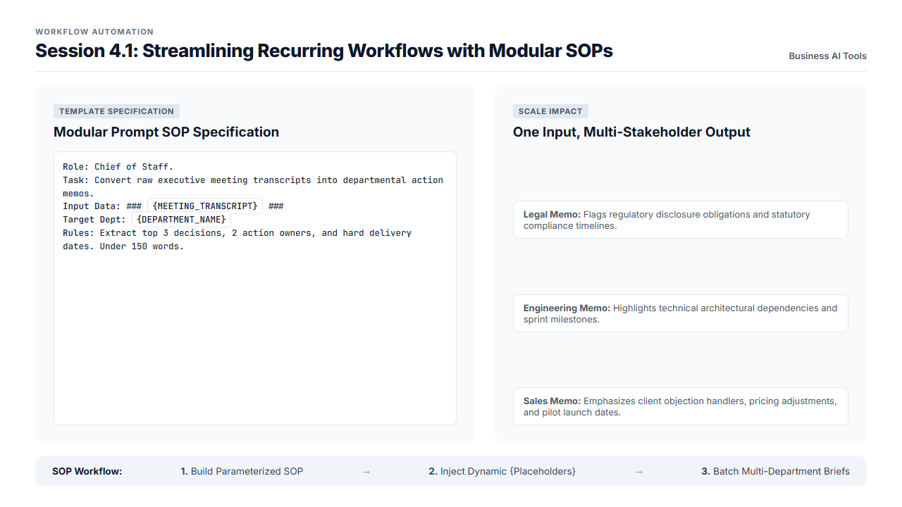

  - **Part 4: Instructor Live Demonstration Script & Discussion (10 min):**  
    *Live Demo:* Open the raw public Federal Reserve meeting minutes. Show students a messy, unstructured paragraph. Paste it into a pre-engineered SOP template with dynamic `{placeholders}`. Show ChatGPT generating an executive 3-bullet briefing memo in 5 seconds.  
    *Discussion Question:* *"How does building reusable prompt templates create measurable business value for a company?"* (Answer: It saves hours of weekly administrative time and guarantees that departmental communication follows a consistent brand standard).
- **Public Data Source:** [US Federal Reserve FOMC Meeting Minutes (Public Record)](https://www.federalreserve.gov/monetarypolicy/fomcminutes20240131.htm) - Free, publicly available formal meeting minutes and economic discussion transcripts.
- **Reference:** [World Economic Forum & Accenture: Jobs of Tomorrow: Large Language Models and Jobs](https://www.weforum.org/publications/jobs-of-tomorrow-large-language-models-and-jobs/) - Deconstructs 19,000 tasks, showing which routine office workflows should be converted into prompt SOPs with dynamic {placeholders}.
- **Prompt Comparison:**
  - **Weak Prompt Example (Vague & Unstructured):**
    ```text
    Summarize these meeting notes from the Fed and tell my manager what happened.
    ```
    *Why it fails:* Produces an unformatted, inconsistent paragraph each week, requiring the employee to spend 15 minutes manually reorganizing deadlines, names, and key decisions.
  - **Strong Prompt Example (Standardized SOP Template with Dynamic Placeholders):**
    ```text
    Act as an Executive Chief of Staff. Process the raw meeting notes provided in {Raw_Meeting_Notes} and generate our standardized Monday Executive Briefing memo.

    Input Parameters:
    - Meeting Date: {Meeting_Date}
    - Department: {Department_Name}
    - Raw Notes:
    ###
    {Raw_Meeting_Notes}
    ###

    Output Schema (Strictly Adhere):
    1. Executive Summary: Exactly 2 sentences synthesizing the primary strategic outcome.
    2. Key Decisions Finalized: Exactly 3 numbered bullets.
    3. Action Item Matrix (Markdown Table):
       | Task Description | Owner | Hard Deadline | Definition of Done |
    Constraint: If any action item lacks an explicit owner in the raw text, write "UNASSIGNED - FLAG FOR REVIEW".
    ```
    *Why it succeeds:* Modular {placeholders} turn one prompt into a permanent corporate asset that anyone on the team can execute in seconds with zero formatting drift.
- **How to Practice:**
  1. **Step 1:** Open the public Federal Reserve meeting minutes page and copy 2 paragraphs of raw discussion on inflation and employment trends.
  2. **Step 2:** Build a reusable SOP prompt template using dynamic variable placeholders: `{Meeting_Date}`, `{Raw_Discussion_Notes}`, and `{Action_Items}`.
  3. **Step 3:** Test your SOP template in ChatGPT by plugging in today's date and the Fed discussion text into `{Raw_Discussion_Notes}`. Prompt: *"Fill in this executive memo template using the provided notes..."*
  4. **Step 4:** Check if the resulting executive email format is consistent, clean, and ready to send. Document your template in the Reusable Prompt SOP Sheet.
- **What to Expect:** Save hours of routine writing time each week while keeping the format consistent and professional.
- **Exercise 1 (Basic - Standardized Meeting SOP Template):**
  - Scenario: Using the official US Federal Reserve FOMC Meeting Minutes public record from this session, extract two paragraphs of unstructured discussion on macroeconomic trends and interest rates.
  - Task: Design a reusable Standard Operating Procedure (SOP) prompt template incorporating dynamic `{placeholders}` (`{Meeting_Date}`, `{Department}`, `{Raw_Discussion_Notes}`). Enforce an output schema requiring a 2-sentence executive summary and a structured Action Item Matrix.
  - Deliverable: Completed Reusable Prompt SOP Sheet containing the parameterized prompt code and the formatted executive output table generated from the Fed minutes.
- **Exercise 2 (Advanced - Multi-Department Briefing Distribution SOP):**
  - Scenario: Using the exact same excerpt of Federal Reserve meeting discussion from Exercise 1, company leadership requires this economic update to be translated into two tailored departmental briefings with divergent operational priorities.
  - Task: Engineer a multi-stakeholder SOP prompt template that ingests `{Raw_Discussion_Notes}` and simultaneously generates: (1) A 100-word Treasury & Cash Flow Brief focused on interest rate risks and capital preservation, and (2) A 100-word Commercial Sales Brief translating economic trends into client purchasing sentiment and sales strategies.
  - Deliverable: A Multi-Department Distribution Memo featuring both tailored briefings and a template documentation card for enterprise departmental rollout.

#### Session 4.2: Troubleshooting & Polishing Prompts


* **Lecture Presentation:** [Download Slides (PDF)](slides/session_4_2_lecture.pdf)

- **Duration:** 3 Hours (180 minutes)
  - *Hour 1 (50 min):* Comprehensive Concept Lecture & Live Demonstration
  - *Hour 2 (50 min):* Guided Hands-On Lab (Basic Exercise: Defensive Fallback Bug Patch)
  - *Hour 3 (50 min):* Applied Business Challenge & Peer Debrief (Advanced Exercise: Adversarial Red-Teaming Stress Test)
- **Goal:** Test prompts with tricky inputs to see where they fail and make them more reliable.
- **Lecture Content (Hour 1 - 50 Minutes):**
  - **Part 1: Defensive Prompt Engineering (15 min):**  
    Prompts that work in a quiet classroom often fail in a busy workplace because real users enter incomplete, messy, or contradictory information. Defensive prompt engineering designs prompts to handle "edge cases" safely without crashing or hallucinating.
  - **Part 2: The "Clarification Fallback" Rule (15 min):**  
    The most critical defensive rule in enterprise prompt design:  
    `"If any required data point (like price, date, or customer name) is missing from the input, do NOT invent or assume a number. Stop immediately and ask the user 3 clarifying questions."`
  - **Part 3: Peer Quality Assurance (QA) Protocols (10 min):**  
    How software engineering QA applies to business prompts: Having a colleague test your prompt with "adversarial" tricky inputs to expose hidden failure modes before deploying the prompt to clients.

    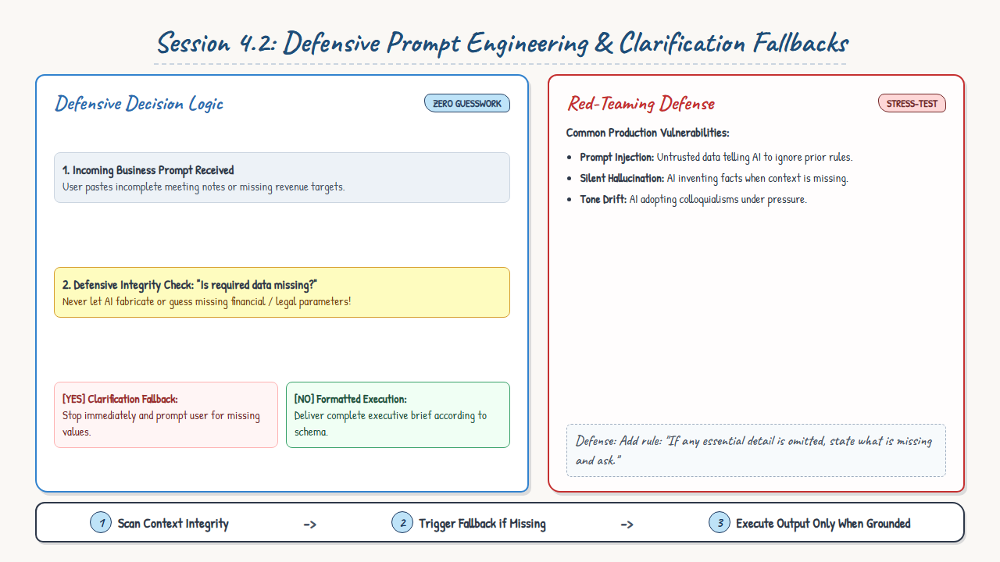

  - **Part 4: Instructor Live Demonstration Script & Discussion (10 min):**  
    *Live Demo:* Take an open-source prompt from the Awesome ChatGPT Prompts GitHub repository (e.g., an advertising budget planner). Enter an edge case: *"Plan a 6-month marketing campaign for our luxury watch brand."* (Notice that no budget was provided). Show ChatGPT hallucinating a $50,000 budget. Then apply the defensive patch to force the AI to halt and ask for the budget.  
    *Discussion Question:* *"What is the business danger of an AI prompt that guesses missing information instead of asking for clarification?"* (Answer: It could cause employees to execute marketing or financial plans based on fabricated numbers, leading to major monetary waste).
- **Public Data Source:** [Awesome ChatGPT Prompts (GitHub Public Open Source)](https://github.com/f/awesome-chatgpt-prompts) - The most widely used open-source collection of community prompts for role-playing and business tasks.
- **Reference:** [OWASP Foundation: Top 10 for Large Language Model Applications](https://owasp.github.io/www-project-top-10-for-large-language-model-applications/) - Enterprise risk guide on prompt injection, hallucinations, and building clarification fallbacks when business input data is missing.
- **Prompt Comparison:**
  - **Weak Prompt Example (Vague & Unprotected against Missing Data):**
    ```text
    Plan a 6-month digital advertising campaign for our new luxury leather goods line.
    ```
    *Why it fails:* The prompt omits the total budget, target demographics, and key channels. ChatGPT hallucinates numbers (e.g., guessing a $100,000 budget), risking expensive strategic misalignment.
  - **Strong Prompt Example (Defensive Prompting with Clarification Fallback):**
    ```text
    You are a Senior Media Planner. You are evaluating a marketing campaign request.

    Client Input:
    """
    Launch a 6-month marketing campaign for our handcrafted leather handbags. Target high-income professionals.
    """

    DEFENSIVE QUALITY GATE (MANDATORY RULE):
    Before drafting any campaign strategy, check whether the input contains the following 3 mandatory data points:
    1. Total allocated advertising budget.
    2. Target customer age bracket and primary geographic market.
    3. Specific performance target (e.g., Target ROAS, sales volume, or email signups).

    IF ANY of these 3 data points are missing:
    - Do NOT fabricate a budget or assume target numbers.
    - Halt immediately and ask the user the 3 specific clarifying questions needed to complete the brief.
    ```
    *Why it succeeds:* Builds a "Clarification Fallback" circuit breaker that halts execution when critical business inputs are missing, eliminating hallucinated budgets.
- **How to Practice:**
  1. **Step 1:** Open the Awesome ChatGPT Prompts repository and choose one business role prompt (e.g., "Act as an Advertiser" or "Act as an Accountant").
  2. **Step 2:** Test the chosen prompt in ChatGPT with complete, normal business information.
  3. **Step 3:** Test the exact same prompt with a tricky edge-case input (e.g., leave out the budget number, give contradictory deadlines, or provide missing customer data).
  4. **Step 4:** Observe whether ChatGPT hallucinated fake numbers or gave unsafe advice. Write a defensive prompt patch (e.g., adding: *"If any required information is missing, do not guess; ask 3 clarifying questions first"*). Log this in your Prompt Bug Report.
- **What to Expect:** Discover that AI will often guess or invent answers if data is missing, and learn how to instruct it to ask questions instead.
- **Exercise 1 (Basic - Defensive Fallback Bug Patch):**
  - Scenario: Select a business prompt from the Awesome ChatGPT Prompts open-source repository (e.g., campaign planner or financial consultant).
  - Task: Test the prompt with normal inputs, then inject a deliberate edge-case input with missing critical variables (e.g., no advertising budget or unstated deadlines). Observe hallucinated values, diagnose the failure mode, and write a defensive "Clarification Fallback" prompt patch instructing the AI to halt and ask clarifying questions.
  - Deliverable: Completed Prompt Bug Report documenting the baseline prompt, the edge-case test applied, observed AI hallucinations, and the revised defensive prompt code.
- **Exercise 2 (Advanced - Adversarial Red-Teaming Stress Test):**
  - Scenario: Using the exact same business prompt role and scenario from Exercise 1, conduct a rigorous adversarial red-teaming audit by subjecting the patched prompt to three severe enterprise stress cases: (1) Contradictory constraints (e.g., "fast turnaround in 2 hours with zero budget"), (2) Malicious prompt injection attempting to override system guidelines, and (3) Incomplete / corrupted input data.
  - Task: Document whether the defensive safeguards held firm or leaked fabricated information, and engineer a hardened enterprise prompt wrapper capable of passing all three stress conditions.
  - Deliverable: An Enterprise Red-Team Audit Log recording the three stress-test inputs, model responses, safeguard pass/fail ratings, and the final hardened prompt code.

#### Session 4.3: Reviewing & Selecting Your Best Prompts


* **Lecture Presentation:** [Download Slides (PDF)](slides/session_4_3_lecture.pdf)

- **Duration:** 3 Hours (180 minutes)
  - *Hour 1 (50 min):* Comprehensive Concept Lecture & Live Demonstration
  - *Hour 2 (50 min):* Guided Hands-On Lab (Basic Exercise: Multi-Attribute Prompt ROI Scoring)
  - *Hour 3 (50 min):* Applied Business Challenge & Peer Debrief (Advanced Exercise: Enterprise Business Case & Deployment Pitch)
- **Goal:** Review all the prompts you created in this course and pick your top 3 most valuable tools.
- **Lecture Content (Hour 1 - 50 Minutes):**
  - **Part 1: Quantifying Business AI Return on Investment (ROI) (15 min):**  
    Teach students how to calculate and present the business value of prompt engineering:  
    `ROI = (Minutes Saved per Task × Task Frequency per Month × Hourly Wage) - Tool Cost`.  
    Demonstrating that saving 30 minutes on a daily report produces over $6,000 in annual labor value per employee.
  - **Part 2: The Multi-Attribute Decision Matrix (15 min):**  
    How to objectively select the highest-performing prompts using 4 weighted criteria:
    1. *Time Saved (1-5):* Degree of labor reduction.
    2. *Output Consistency (1-5):* Reliability across different inputs.
    3. *Practical Business Value (1-5):* Impact on revenue, customer satisfaction, or risk reduction.
    4. *Ease of Reusability (1-5):* Can colleagues use this prompt without training?
  - **Part 3: Articulating AI Skills on a Business Resume (10 min):**  
    Replacing buzzwords like *"Proficient in ChatGPT"* with concrete, high-impact accomplishments: *"Engineered 5 standardized business prompt templates, reducing weekly customer report drafting time by 65% with 100% format compliance."*

    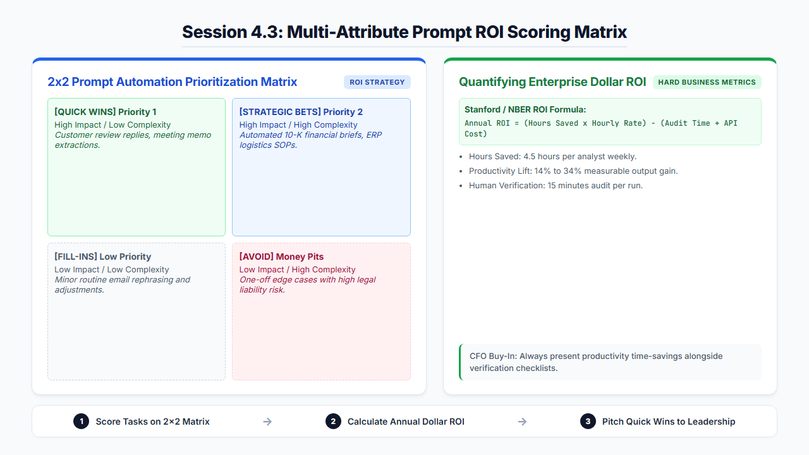

  - **Part 4: Instructor Live Demonstration Script & Discussion (10 min):**  
    *Live Demo:* Review the Stanford HAI AI Index Report findings on knowledge worker efficiency. Take 4 student-created prompt templates from earlier in the course. Score them live on the matrix to show how to make objective trade-offs between a complex tool and a simple, high-frequency tool.  
    *Discussion Question:* *"Why is a simple prompt used 5 times a day often more valuable to a company than a complex prompt used once a year?"* (Answer: High-frequency prompts generate continuous cumulative time savings and reduce daily cognitive fatigue).
- **Public Data Source:** [Stanford HAI Artificial Intelligence Index Report (Free Public PDF)](https://aiindex.stanford.edu/report/) - Free annual public research tracking AI productivity and business impact across industries.
- **Reference:** [NBER / Stanford & MIT: Generative AI at Work (Working Paper 31161)](https://www.nber.org/papers/w31161) - Empirical study quantifying 14%-34% productivity gains, providing the exact formula to calculate prompt ROI.
- **Prompt Comparison:**
  - **Weak Prompt Example (Subjective & Unquantified):**
    ```text
    Which of these 3 prompt templates that I wrote this semester is the best one?
    ```
    *Why it fails:* ChatGPT gives a polite, subjective compliment to all 3 prompts without assessing enterprise reusability, failure risk, or labor time savings.
  - **Strong Prompt Example (Multi-Attribute ROI Evaluation Framework):**
    ```text
    You are a Corporate AI Transformation Consultant. Evaluate the 3 candidate prompt templates attached below for an entry-level financial analyst.

    Candidate Prompts:
    - Prompt A (Daily 15-min Customer Ticket Triage; used 20x/month)
    - Prompt B (Monthly 3-hour Board Deck Financial Summary; used 1x/month)
    - Prompt C (Weekly 45-min Vendor Invoice Dispute Email; used 4x/month)

    Evaluation Directive:
    1. Calculate Monthly Labor Hours Saved for each prompt: (Minutes Saved per Task * Monthly Frequency) / 60.
    2. Rate Output Consistency (1 to 5 scale based on prompt constraint clarity).
    3. Score Business Risk (Low / Medium / High based on risk of hallucinated figures).
    4. Provide a definitive ranking of the #1 most valuable prompt to deploy across the team, supported by quantitative ROI calculations.
    ```
    *Why it succeeds:* Evaluates business prompt assets through empirical unit economics and risk mitigation rather than subjective preference.
- **How to Practice:**
  1. **Step 1:** Open the Stanford HAI report summary and review the data on how much time knowledge workers save when using AI tools.
  2. **Step 2:** Collect all prompts and templates you designed throughout Sessions 1.1 to 4.2 into one master document.
  3. **Step 3:** Test your top 4 favorite prompts with fresh scenarios, timing how long each task would take manually vs. with AI.
  4. **Step 4:** Score each candidate across 4 dimensions: (1) Time Saved, (2) Output Accuracy, (3) Practical Usefulness, and (4) Reusability (1 to 5 points each). Officially select your top 3 in the Top 3 Selection Matrix.
- **What to Expect:** Build confidence by identifying the exact prompts that save you the most time and deliver high-quality business results.
- **Exercise 1 (Basic - Multi-Attribute Prompt ROI Scoring):**
  - Scenario: Grounded in worker productivity data from the Stanford HAI AI Index Report and NBER working paper, gather 4 prompt templates you engineered during this course.
  - Task: Evaluate all 4 candidate prompts across four weighted criteria: Time Saved (1-5), Output Consistency (1-5), Practical Business Value (1-5), and Ease of Team Reusability (1-5). Quantify the monthly labor hours saved using the empirical formula: `(Minutes Saved per Task * Monthly Frequency) / 60`.
  - Deliverable: Completed Top 3 Selection Matrix with weighted evaluation scores, calculated monthly time savings, and definitive ranking of your top 3 prompt assets.
- **Exercise 2 (Advanced - Enterprise Business Case & Deployment Pitch):**
  - Scenario: Using the exact same top-ranked prompt asset and calculated labor savings from Exercise 1, prepare a formal business case to convince your department head or executive leadership to adopt this prompt across a 25-person team.
  - Task: Engineer an advanced prompt instructing ChatGPT to act as a Management Consulting Engagement Manager. Structure a 1-page Enterprise Adoption Pitch containing: annual labor dollar savings calculation (assuming a $35/hour average analyst wage), an implementation risk mitigation plan (training and human audit sign-offs), and a 30-day pilot rollout schedule.
  - Deliverable: A 1-page Executive Business Case & Enterprise Deployment Pitch Memo complete with quantitative ROI calculations and governance safeguards.

#### Session 4.4: Building Your Professional Prompt Portfolio


* **Lecture Presentation:** [Download Slides (PDF)](slides/session_4_4_lecture.pdf)

- **Duration:** 3 Hours (180 minutes)
  - *Hour 1 (50 min):* Comprehensive Concept Lecture & Live Demonstration
  - *Hour 2 (50 min):* Guided Hands-On Lab (Basic Exercise: 5 Standardized Production Prompt Cards)
  - *Hour 3 (50 min):* Applied Business Challenge & Peer Debrief (Advanced Exercise: Portfolio Defense & Recruiter Simulation)
- **Goal:** Assemble a ready-to-use collection of 5 business prompts to show in job interviews or use at work.
- **Lecture Content (Hour 1 - 50 Minutes):**
  - **Part 1: Industry Documentation Standards for Prompt Assets (15 min):**  
    Leading AI consultancies do not save prompts as messy chat logs; they document them like corporate software assets. An enterprise Prompt Specification Card allows any manager or intern to run the prompt safely.
  - **Part 2: The 4 Mandatory Anatomy Pillars of a Production Prompt Card (15 min):**  
    1. *Business Objective & Target Role:* What problem does it solve, and who uses it?
    2. *Master Reusable Template:* Complete prompt with explicit dynamic `{placeholders}` and delimiters.
    3. *Edge-Case Warning:* Explicit boundaries detailing when this prompt should NOT be used.
    4. *Human-in-the-Loop Verification Checklist:* Mandatory checks before the output is sent to a client or executive.
  - **Part 3: Interview Demonstration Strategy for Business Students (10 min):**  
    How to present your portfolio to corporate recruiters during interviews: Walking through your prompt engineering process, demonstrating before-and-after results, and explaining your verification safeguards.

    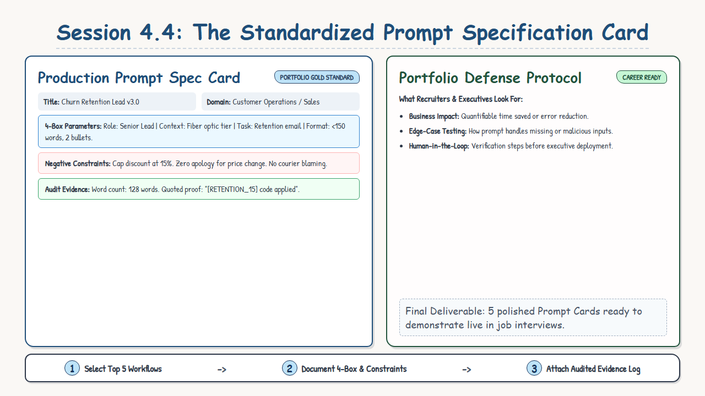

  - **Part 4: Instructor Live Demonstration Script & Discussion (10 min):**  
    *Live Demo:* Walk through an exemplary, production-grade Prompt Specification Card. Show students how to conduct the final human sign-off check, highlighting how a completed portfolio differentiates a business graduate in the competitive job market.  
    *Discussion Question:* *"Why do employers value a job applicant who brings a documented prompt portfolio over one who simply claims they 'use AI'?"* (Answer: It proves the applicant understands risk management, quality control, and business process automation, rather than just casual chatting).
- **Public Data Source:** [OpenAI Official Prompt Engineering Guide](https://platform.openai.com/docs/guides/prompt-engineering) - Free public guide and documentation for industry-standard prompt formatting and best practices.
- **Reference:** [McKinsey & Company: Rewired: The Enterprise Playbook for Building Digital & AI Capabilities](https://www.mckinsey.com/capabilities/mckinsey-digital/our-insights/rewired-the-mckinsey-guide-to-outcompeting-in-the-age-of-digital-and-ai) - Enterprise playbook on documenting standardized Prompt Specification Cards with human-in-the-loop verification for a professional portfolio.
- **Prompt Comparison:**
  - **Weak Prompt Example (Casual, Undocumented Chat Log):**
    ```text
    Here is a prompt I made: "Act as a market researcher and summarize this industry report in 3 bullets."
    ```
    *Why it fails:* Undocumented, fragile, and unimpressive to employers. It looks like casual chatting rather than an engineered corporate workflow asset.
  - **Strong Prompt Example (Production Prompt Specification Card Architecture):**
    ```text
    ### PROMPT SPECIFICATION CARD: EXECUTIVE DATA SYNTHESIZER v1.2
    - Target Business Role: FP&A Lead / Operations Chief of Staff
    - Business Objective: Transform raw tabular operational data into an executive exception brief for C-suite decision-makers.

    --- MASTER PROMPT TEMPLATE ---
    Role: Senior Operations Director.
    Business Context: Weekly review of regional fulfillment center performance metrics.
    Data Input: {Raw_Fulfillment_Table}

    Directives:
    1. Flag all fulfillment centers where SLA on-time delivery fell below 92.0%.
    2. For each flagged facility, identify the primary operational bottleneck from the notes column.
    3. Output Schema: Markdown table with columns [Facility | Actual SLA | Variance from Target | Root Cause | Immediate Action Item].

    --- DEFENSIVE BOUNDARY & EDGE CASES ---
    - When NOT to use: Do NOT use this prompt on raw unformatted customer chat logs or financial accounting balance sheets.
    - Missing Data Fallback: If SLA numbers are absent, halt and output: "ERROR: SLA metrics missing from row [X]".

    --- HUMAN-IN-THE-LOOP VERIFICATION CHECKLIST ---
    [ ] 1. Cross-check flagged SLA percentages against raw source database.
    [ ] 2. Confirm suggested action items comply with current union labor agreements.
    [ ] 3. Verify total facility count matches regional manifest before sending.
    ```
    *Why it succeeds:* Represents a complete enterprise-grade software asset with master parameters, failure boundaries, and human sign-off checklists suitable for an executive portfolio.
- **How to Practice:**
  1. **Step 1:** Review the OpenAI Prompt Engineering Guide for industry-standard formatting conventions (delimiters like `###`, variable tags `{...}`, and few-shot examples).
  2. **Step 2:** Select your 5 strongest prompt templates from across the semester (e.g., Customer Response, Financial Summary, SOP Meeting Memo, 5-Whys Diagnostics, Persona Generator).
  3. **Step 3:** Format each of the 5 prompts into a standardized card containing: (1) Target Role & Objective, (2) Master Prompt Template with `{placeholders}`, (3) Warning on when NOT to use it, and (4) A 3-point human verification checklist.
  4. **Step 4:** Review and proofread all 5 Prompt Cards in your workbook to ensure they are professional and ready to demonstrate in job interviews or internships.
- **What to Expect:** Walk away with a concrete, professional portfolio that proves your practical AI skills to future employers.
- **Exercise 1 (Basic - 5 Standardized Production Prompt Cards):**
  - Scenario: Utilizing documentation conventions from the OpenAI Official Prompt Engineering Guide and McKinsey Rewired framework, curate your 5 most valuable business prompt templates.
  - Task: Document each prompt into an enterprise-grade Prompt Specification Card detailing: (1) Target Business Role & Operational Objective, (2) Master Reusable Template with explicit `{placeholders}` and delimiters, (3) Edge-Case Boundaries and when NOT to use the prompt, and (4) A 3-point Human-in-the-Loop Verification Checklist.
  - Deliverable: Five completed Production Prompt Specification Cards assembled into a clean, ready-to-share portfolio document.
- **Exercise 2 (Advanced - Portfolio Defense & Recruiter Simulation):**
  - Scenario: Using the exact same 5 Prompt Specification Cards assembled in Exercise 1, prepare to defend your prompt portfolio in a competitive job interview or corporate review.
  - Task: Engineer an interview simulation prompt where ChatGPT roleplays as an experienced Corporate Strategy Recruiter or Chief Information Officer. The AI interviewer asks 3 challenging, skeptical questions regarding your prompts (e.g., probing how you prevent hallucinations in financial data, how you safeguard client PII, and how you ensure consistent output across team members). Answer each question and instruct the AI to provide constructive critique on your business defense.
  - Deliverable: An Interview Defense Transcript & Portfolio Talking Points Sheet summarizing your answers to executive probing questions and articulating your enterprise prompt engineering value proposition.
-->
